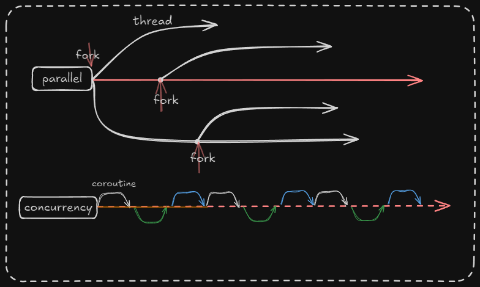
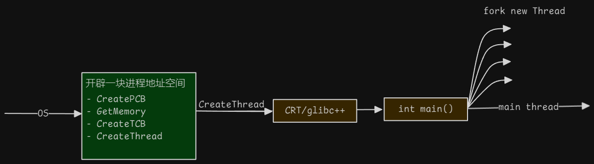
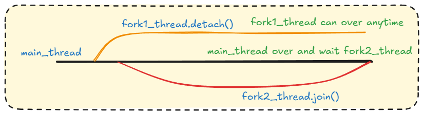
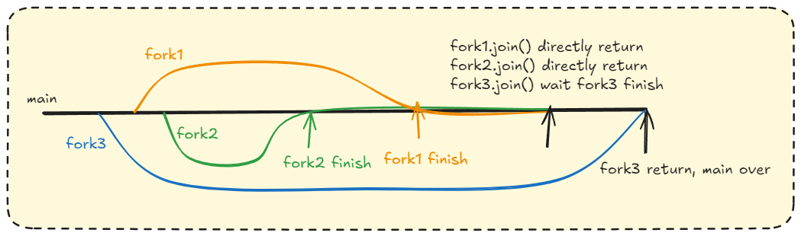
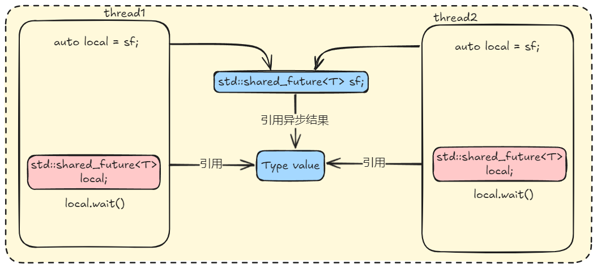
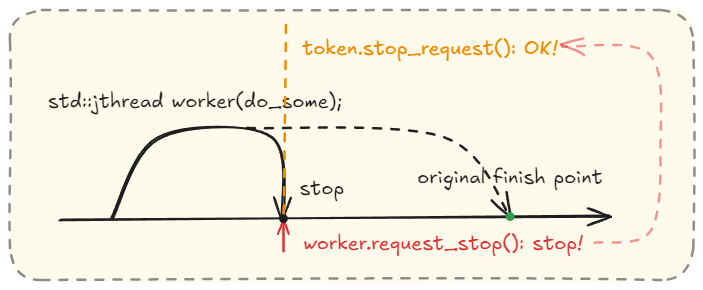
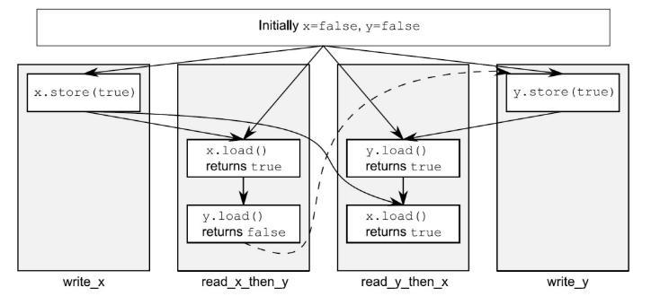
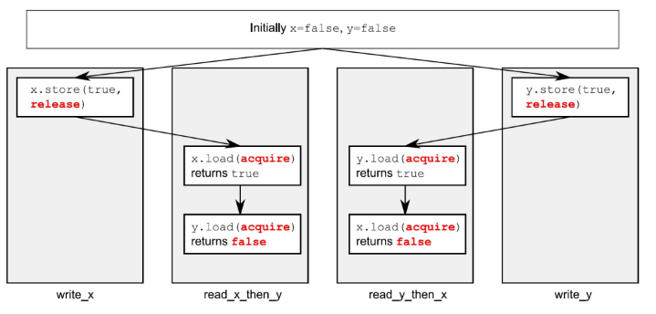

<!-- toc -->

[C++ Core Guidelines: concurrency](https://isocpp.github.io/CppCoreGuidelines/CppCoreGuidelines#S-concurrency)
# 线程
## The theory of concurrent programming > 程序执行基于线程
在多线程编程中并行与并发是一个非常常见的一个字眼。但是两者实际上从某种程度来说是完全不同的概念



可以通过 `std::thread::hardware_concurrency()` 来获得当前硬件支持的并发线程的最大值.
使用namespace `std::this_thread` 可以获取当前线程的各种信息:
- [`yield()`](https://en.cppreference.com/w/cpp/thread/yield.html): 建议实现重新调度各执行线程
- [`get_id`](https://zh.cppreference.com/w/cpp/thread/get_id): 返回当前线程 id
- [`sleep_for`](https://zh.cppreference.com/w/cpp/thread/sleep_for): 使当前线程停止执行指定时间
- [`sleep_until`](https://zh.cppreference.com/w/cpp/thread/sleep_until): 使当前线程执行**停止到**指定的时间点

以上是一些概念, 在实际中所谓高并发环境实际上, 同时在多个线程上进行并发. 也就是多个线程执行多个协程(可以暂停的函数). 
正如下图:


## C++11 `std::thread`
C++11之后封装好的线程对象thread接受一个**可调用对象(callable)**, 换句话说就是一个可以执行的东西, 可以是函数, 可以是 lambda 表达式, 可以是重载了 `()` 的类.

> [!note] Callable
> 一个Callable类型是指代一个可以进行 INVOKE 操作的类型
> ```Cpp
> INVOKE(f, arg_0, arg_1,… , arg_N);
> ```
> [Cppref-INVOKE](https://en.cppreference.com/w/cpp/functional.html)

创建一个线程thread, `std::thread t;` 此时 `t` 只是一个占位符, 并不是一个线程. 如果后续需要分配任务, 使用thread的移动语义. (thread不能拷贝). 
指派任务即可以在初始化时指派, 也可以在后续指派. 指派任务本身就是一个 INVOKE 操作, 传入需要执行的函数 func 和其对应的 参数 arg_1, arg_2,..., arg_N 即可.
```Cpp
std::thread t(F&& func, Args&&.. args);
```
这里的 arg 默认是按值拷贝的, 如果可调用对线的参数中有引用传递, 则需要用 `std::ref` 或者 `std::cref` 包装(lambda表达式按引用捕获则不用std::ref包装). 由于 `std::thread` 没有返回值, 所以如果要传递参数则需要传递引用. 这里的 func 只要是一个 Callable 对象即可.
注意: 
1. std::ref 包装的引用必须存活
2. 可调用对象 func 具体什么时候执行不能确定, 这取决于CPU的调度, thread 的构造器只是启动一个线程.
```Cpp
void dangerous() { 
	int x = 10; 
	std::thread t(func, std::ref(x)); 
	t.detach(); /* x将很快析构，导致悬空引用, 改为 join() */  
}
```

同时可调用对象还可以有返回, 但是thread会忽略这个返回值. 如果想接住这个返回值需要借助 `std::future`. 见后.

> [!note] 
> 在编译时，如果出现找不到 `pthread_create` 这个函数，原因是 `std::thread` 是基于pthread的所以需要在CMakeLists.txt中边界 `Threads::Threads`
>
>```cmake
>   find_package(Threads REQUIRED)
>   target_link_libraries(cpptest PUBLIC Threads::Threads)
>```
## 线程的结束方式
### join and detach
线程的结束方式有两种：`join()` 和 `detach()`. 
其具体的关系如下: 



正如图中所示, 当 fork1_thread 调用其join()时, 其父线程必须等待其结束能继续进行后续操作. 而 fork2_thread 调用 detach() 时, 父线程则不需要等待他的结束. 当线程调用 `detach()` 必须要保证在 主线程main 结束之前结束, 不然main结束会释放资源, 如果此时子线程还没有结束则会导致使用一个已经被释放的资源. detach 之后 主线程对该线程则失去控制权, 在Unix语境下, detach的线程一般称作守护线程(daemon thread). 这类线程一般会在后台长时间运行. 虽然也可以将detach认为是即用即扔的线程, 但是要**保证其必须在main结束之前完成, 且不要持有资源**. 通常情况下都是不建议使用 `detach()`

但是同时也要知道等待线程join可能是一件非常耗时的时候, 所以一般会在最后join. 但是detach()可以在一开始就进行, 因为反正也不需要等他返回. 

如果既不调用 `join()` 也不调用 `detach()`. 当线程对象的析构函数被调用时（通常在离开作用域或显式销毁时），由于线程对象仍然和一个活动的线程相关联，这会导致调用 `std::terminate()`，终止整个程序。



 `std::thread` 需要手动的调用 `join()` 或者 `detach()`, 此时你应该通过thread_guard类保证在作用域结束之后自动调用的 `join()` 或者使用C++20的jthread

> [!note] `joinable()`
> 初始化子线程 `t` 后, 该子线程的状态会被初始化, 即 状态内部的 thread::id 会被赋予一个正整数. 所谓 `joinable()` 本质上是在判断id是否为0。换句话说 `joinable()` 实际上是在判断线程的状态是否为空, 而判断的依据就是id是否为0。当其detach之后也就独立于父线程运行, 此时的线程状态会被赋值为空。所以在官方的描述中,  `joinable()` 返回 `true` 则意味着可以通过 `this_thread::get_id()` 得到这个线程的唯一标识. 但是当detach之后线程的状态会被设置为空. 换句话说, 一旦将一个线程detach之后就再也无法直接控制这个线程, 只能按照其原本的逻辑运行直至结束. 
> 以下情况 `joinable()` 会返回 false:
> - 默认构造 thread, 此时 thread 只是占位符
> - `join()` 完成的线程
> - `detach()` 后的线程
> - 被移动的线程对象
>
> 所以大致上来说可以做
> ```Cpp
> if (t.joinable())
> 	t.join();
> ```

如果说用于初始化线程的可调用对象抛出异常但是没有处理时, 异常不会跨线程传播而是使用 `std::terminate()`. 如果内部处理了异常自然无事发生. 
```cpp
int main() {
	try { 
	/*
		根本捕获不到,而是直接 std::terminate()
		异常不会传播到主线程
	*/
		std::thread thread([] {
			throw std::runtime_error("Error occurred");
		});
	}
	catch (const std::exception& e) {
		std::cout << "Caught exception: " << e.what() << std::endl;
	}
	std::thread thread([] { 
		try { 
		// 在内部处理
			throw std::runtime_error("Error occurred"); 
		} catch (const std::exception& e) { 
			std::cout << "Caught exception in thread: " << e.what() << std::endl; 
		}
	});
	return 0;
```

### thread_guard
如果您迫不得已使用thread, 可能会出现
在启动线程之后, `join()` 之前, 如果发生异常则很有可能会漏掉 `join()`. 需要在 `catch` 中手动的 join. 这就又回到了C语言最初的 malloc-free 的问题上了, 这就又违反了RAII思想. 所以建议您通过封装一个类 `thread_guard` 来保护您的程序的正常运行.

```cpp
class thread_guard{
	std::thread& t;\
public:
	explicit thread_guard(std::thread& t):t(t){}
	~thread_guard(){
		if(t.joinable()) t.join();
	}
	thread_guard(const thread_guard&) = delete;
	thread_guard& operator=(const thread_guard&) = delete;
};
```
使用的时候只要用 `thread_guard g(t);` 即可. 这样在退出main的代码块时, 自动调用 `thread_guard` 的析构函数. 

线程和 `unique_ptr` 一样是不能拷贝只能移动. 移动之后就原来线程死亡, 由新线程继续完成Task.(从上一个线程未完成的地方继续干). 

和 `thread_guard` 的思路一样, 移动之后的线程也要保证其可以自动的 `join()`..
```cpp
class scoped_thread{
	std::thread t;
public:
	explicit scoped_thread(std::thread t):t(std::move(t)){
		if(!t.joinable())
			throw std::logic_error("cant joinable()");
	}
	~scoped_thread(){
		t.join();
	}
	scoped_thread(const scoped_thread&) = delete;
	scoped_thread& operator=(const scoped_thread&) = delete;
};
```
所以一个完整的 thread_guard 如下：

```cpp
class thread_guard {
    std::thread& t_ref;  // 引用，管理左值时使用
public:
    // 接受左值引用的构造函数
    explicit thread_manager(std::thread& t_ref)
        : t_ref(t_ref) {
        if (!t_ref.joinable()) {
            throw std::logic_error("Thread is not joinable");
        }
    }
    // 接受右值的构造函数
    explicit thread_manager(std::thread&& t)
        : t_ref(t){
        if (!t_ref.joinable()) {
            throw std::logic_error("Thread is not joinable");
        }
    }
    // 析构函数：自动 join
    ~thread_manager() {
        if (t_ref.joinable()) {
            t_ref.join();
        }
    }
    // 禁用拷贝构造和拷贝赋值
    thread_manager(const thread_manager&) = delete;
    thread_manager& operator=(const thread_manager&) = delete;
    // 禁用移动构造和移动赋值
    thread_manager(thread_manager&&) = delete;
    thread_manager& operator=(thread_manager&&) = delete;
    std::thread&& get() { // 把线程吐出来
        return std::move(t_ref);
    }
    std::thread& get() const{
        return t_ref;
    }
};
```

## 接收线程函数执行的结果 > future
之前提到的方式是使用 `std::ref()` 传递一个 res 变量, 同时在标准库中提供了一种新的方式去接收线程内函数的执行结果的方式 std::async 和 futrue. 

### `std::async`
除 `thread` 之外, 标准库还提供了一个更方便使用的版本: `std::async`. 该对象的使用可以说和 `std::thead` 几乎一样, 唯一不同的是其构造函数多一个重载. 其同样接受一个可调用对象和其需要的所有参数. 但是其返回一个 `std::future`. 相当于一个返回future版本的thread. `
`std::future` 是 C++11 引入的标准库组件，用于获取异步操作的结果。`std::future` 是一个对象, 其中保存了线程运行的结果. 换句话说, `std::future` 可以间接接住 `thread` 的返回结果. 这里的间接的意思, `std::thread` 不直接支持返回值, 需要通过 `std::packaged_task` 来包装 `std::thread`.

同时 `std::future` 需要通过 `get()` 方法来获取结果, 如果当前线程调用 `get()` 但是其结果还没计算出来,则会阻塞试图获取结果的线程. 如果希望确保在 `get()` 的时候拿到结果, 则可以显示调用 `wait()` 等待其计算结果,然后再 `get()`. 

对于 `wait()` 还有两个计时的版本 `future::wait_for()`, `future_until()` 其内涵是不希望线程无限等待, 再等一段时间或等到某个时间点即可. 其可能会返回三种状态, 这个返回状态保存在 `future::status` 中

| 状态                         | 说明                                             |
| -------------------------- | ---------------------------------------------- |
| `future::status::deferred` | 共享状态包含一个使用惰性求值的延迟函数，仅在明确请求时才计算其结果, 也就是使用get()时 |
| `future::status::ready`    | 共享状态已就绪, 已经算完了                                 |
| `future::status::timeout`  | 超时了, 超时不代表计算结果失效, 还是可以继续算的                     |

 `std::async` 内部的处理是, 重新申请一个新的线程然后调用新申请的线程, 然后将其结果返回到 `std::future` 中(借助 `promise`).. 也就是异步的执行该可调用对象

正如刚刚所说 `std::async` 还有一个构造函数的重载, 其第一个参数是一个启动策略, 之后的参数还是同上..

| 启动策略                    | 说明                                      |
| ----------------------- | --------------------------------------- |
| `std::launch::async`    | 正如上所说, 创建一个新线程异步的执行task                 |
| `std::launch::deferred` | 不创建线程, task会被延迟计算, 在将async返回给future时求值. |
```Cpp
/* 获取共享状态, 如果此时共享状态还没就绪, 该函数阻塞至就绪 */
future::get() 
/* 等待futrue对象, 返回状态码 ready, timeout, deferred */
/*
 * ready: 就绪, 此时 future::get() 就可以直接拿到结果
 * timeout: 超时
 * deferred: 显示设置之后才有的返回值, 有延缓执行的函数
 */
future::wait()
future::wait_for()   /* 等待多久 */
future::wait_until() /* 等待到何时 */
future::share()      /* 用于多个线程共享结果 */
/* Example:
* 1. std::shared_future<Tp> shared_(prormise.get_future());
* 2. auto shared_future = future.share();
*/

```

注意: 
- 不建议将 std::async 和 thread_local存储周期的变量混用, 因为 std::async 的创建线程的行为是实现定义的, 并不一定会真的创建一个新线程, 由可能从线程池中放回和申请 这可能导致 thread_local 并不一定会线程任务完成时被销毁. [MSVC-async](https://learn.microsoft.com/zh-cn/cpp/standard-library/future-functions?view=msvc-170)
- 如果从 `std::async` 获得的 `std::future` 没有被移动或绑定到引用，那么在完整表达式结尾， `std::future` 的[析构函数](https://zh.cppreference.com/w/cpp/thread/future/%7Efuture)将阻塞，直到到异步任务完成。因为临时对象的生存期就在这一行，而对象生存期结束就会调用调用析构函数。
```Cpp
std::async(std::launch::async, []{ f(); }); /* 临时量的析构函数等待 f() */ 
std::async(std::launch::async, []{ g(); }); /* f() 完成前不开始 */ 
```
所以正确的写法是​​延长 `std::future` 的生命周期​​，确保它不会在表达式结束时被销毁
```Cpp
auto future_f = std::async(std::launch::async, []{ f(); }); /* 存储 future */ 
auto future_g = std::async(std::launch::async, []{ g(); }); /* 不会阻塞 */ 
```
- 被移动的 `std::future` 没有所有权，失去共享状态，不能调用 `get`, `wait ` 成员函数
```Cpp
auto t = std::async([] {});
std::future<void> future{ std::move(t) };
t.wait();   // Error! 抛出异常
```
- std::future 是一次性的, 调用过 get() 之后就会失去共享状态, 对一个失去共享状态的 future 再次调用 get(), 会跑出 `future_error::no_state`

### `std::shared_future`
如果多个线程都需要使用future, 此时可以使用 `std::shared_future` 类似 `std::shared_ptr`, `std::future` 是只能移动的，其所有权可以在不同的对象中互相传递，但只有一个对象可以获得特定的同步结果。而 `std::shared_future` 是可复制的，多个对象可以指代同一个共享状态.
即便有了 `shared_future` 多线程之间也不是同步的, 在多个线程中对**同一个 `std::shared_future` 对象进行操作时（如果没有进行同步保护）存在条件竞争。而从多个线程访问同一共享状态，若每个线程都是通过其自身的 `shared_future` 对象副本**进行访问，则是安全的.

```Cpp
std::string fetch_data() {
    std::this_thread::sleep_for(std::chrono::seconds(1)); // 模拟耗时操作
    return "从网络获取的数据！";
}

int main() {
    std::future<std::string> future_data = std::async(std::launch::async, fetch_data);

    /* 转移共享状态，原来的 future 被清空  valid() == false */ 
    std::shared_future<std::string> shared_future_data = future_data.share();

    /* 第一个线程等待结果并访问数据 */ 
    /* 由于是引用捕获, 存在数据竞争 */
    /* std::thread thread1([shared_future_data] ... */
    std::thread thread1([&shared_future_data] {
        std::cout << "线程1：等待数据中..." << std::endl;
        shared_future_data.wait();
        std::cout << "线程1：收到数据：" << shared_future_data.get() << std::endl;
    });

    /* 第二个线程等待结果并访问数据 */ 
    /* 由于是引用捕获, 存在数据竞争 */
    /* std::thread thread2([shared_future_data] ... */
    std::thread thread2([&shared_future_data] {
        std::cout << "线程2：等待数据中..." << std::endl;
        shared_future_data.wait();
        std::cout << "线程2：收到数据：" << shared_future_data.get() << std::endl;
    });

    thread1.join();
    thread2.join();
}
```
### `std::packaged_task`
```cpp
int compute(int x) {
    std::this_thread::sleep_for(std::chrono::seconds(5)); // 模拟耗时操作
    return x * x;
}
int main() {
    std::future<int> fut = std::async(std::launch::async, compute, 5);
    std::chrono::seconds initial_timeout(2);
    std::chrono::seconds additional_timeout(2);
    while (true) {
        // 初次等待
        if (fut.wait_for(initial_timeout) == std::future_status::timeout) {
            std::cout << "初次超时，任务尚未完成，继续等待..." << std::endl;
        } else {
            // 任务已完成
            int result = fut.get();
            std::cout << "计算结果: " << result << std::endl;
            break;
        }
        // 继续等待
        if (fut.wait_for(additional_timeout) == std::future_status::timeout) {
            std::cout << "继续超时，任务仍然未完成..." << std::endl;
        } else {
            // 任务完成
            int result = fut.get();
            std::cout << "计算结果: " << result << std::endl;
            break;
        }
    }
    return 0;
}
```

具体来说,  `std::packaged_task` 可以封装一个 可调用对象(callable), 将这个可调用对象和 `std::future` 绑定. 将可调用对象的返回值保存进一个future对象中.
`std::packaged_task` 存在一个 `operator()` 的重载, 但是其返回值是 void.

| 接口             | 说明                                          |
| -------------- | ------------------------------------------- |
| `get_future()` | 将内部的 `std::future` 保存                       |
| `reset()`      | 重置状态，抛弃任何先前执行的存储结果                          |
| `valid()`      | 检查合法性: 任务是可调用的, 任务还没有执行, 任务还没有被移动 返回 `true` |
| `operator()`   | 可以直接调用                                      |
注意: `std::packaged_task` 可以接受移动, 但不能拷贝.

```cpp
int f(int x, int y) { return std::pow(x,y); }
void task_lambda(){
    std::packaged_task<int(int, int)> task([](int a, int b){
        return std::pow(a, b); 
    });
    std::future<int> result = task.get_future();
    task(2, 9);
    std::cout << "task_lambda:\t" << result.get() << '\n';
}
void task_bind(){
    std::packaged_task<int()> task(std::bind(f, 2, 11));
    std::future<int> result = task.get_future();
    task();
    std::cout << "task_bind:\t" << result.get() << '\n';
}
void task_thread(){
    std::packaged_task<int(int, int)> task(f);
    std::future<int> result = task.get_future();
 
    std::thread task_td(std::move(task), 2, 10);
    task_td.join();
 
    std::cout << "task_thread:\t" << result.get() << '\n';
}
int main(){
    task_lambda();
    task_bind();
    task_thread();
}
```


### 定制的线程同步组件 `std::promise`
如果你有更细粒度控制线程同步的需要, 标准库提供了 `std::promise` 对象, 其实 `std::packaged_task` 和 `std::async` 内部都基于  `std::promise` . 这里的核心逻辑在于 如何将不支持返回结果的 `std::thread` 和 `std::future` 联系起来. 

所以,  `std::promise` 需要提供一个std::future和一个value. 其中value用于接受结果, future用于保存这个value.. 于是 `std::promise` 有 `set_value()` 这个接口, 同时考虑到异常的情况,  还有一个 `set_exception()` 这个接口. 设置好之后 `std::promise` 会自动存到其内部的future中. 通过 `get_future()` 来获取这个future. 所以, 一个流程:
```cpp
void add(int a, int b, std::promise<int> promises){
	promises.set_value(a+b);
}
int main(){
	std::promise<int> promises;
	std::future<int> res = promises.get_future();
	std::thread work_thread(add, 1, 1, std::move(promises));
	std::cout << res.get() << std::endl;
	return 0;
}
```
注意: 
1. 在申请 `std::promise` 之后马上用一个future 接住 `promises.get_future()`, 因为在使用thread会转移 `promises` 的所有权至执行任务的线程, 因为 `std::promise` 不能拷贝只能移动. 
2. `std::promise` 只能使用一次

> [!q] 为什么提前调用 `get_future()`?
> Q: 上例中 `std::future<int> res = promises.get_future();` 提前赋值之后不应该 promises发生的变化res都感知不到了吗？
> A: 这个问题存在一个巨大的误会. promise 和 future 之间的实际上有一个共享的空间或者说一个共享状态. promise负责设置这个状态通过set方法, future负责读取这个状态通过get方法. 将 promise 和 future 用一个共享状态链接起来就是通过 `=` 运算符. 上例就是 `std::future<int> res = promises.get_future();`
>  所以你需要在promise的所有权在移动到另一个线程之前完成这个设置

他们本质上是一种线程通信, 线程A作为发送方 使用 `promise::set_value()` 将结果(包括异常 `promise::set_exception`)存入共享状态中, 在线程B(接收方) 使用 `future::get()` 去获取结果. 
```Cpp
template <typename Res>
class promise; /* 值传递结果 */
class promise<Res&>; /* 引用传递结果 */
class promise<void>; /* 线程间发送完成时信号, 不传数据 */
```
注意: `std::future` 对象是通过 `promise::get_future()` 来创建的, 且二者是一对一的, 只能调用一次 `get_future()`

Example1 基础用法:
```Cpp
void compute_pi(cobst long num_steps, std::promise<double>&& pr){
	try{
		if (num_steps == 0){
			throw std::runtime_error("divide zero error");
		}
		double step = 1.0 / num_steps;
	    double sum = 0.0;
	    for (long i = 0; i < num_steps; ++i){
		  	 double x = (i + 0.5) * step;
		  	 sum +=4.0 / (1.0 + x * x);
		}
  		pr.set_value(sum * step);
	}catch(...){
		pr.set_exception(std::current_exception());
	}
}
void display(std::shared_furture<double> receiver){
	try{
		double pi = receiver.get(); /* 阻塞则一直等待, 可以抛异常 */
  		std::cout <<  pi << std::endl;
	}catch(std::runtime_error& e){
		std::cerr << e.what() << "\n";
	}
	
}
int main(){
	/* ... */
	std::promise<double> promise;
	std::shared_future<double> shared_receiver(promise.get_future());
	/* or: auto receiver = promise.get_future(); */
	/* or: auto receiver = promise.get_future(); */
	/*     shared_receiver = receiver.share();   */
	/* 如果使用std::ref() 可能会导致 promise 对象已经失效, 但是传递引用 */
	std::thread th1(compute_pi, N_STEPS, std::move(promise));
	std::thread th2(display, shared_receiver);
	/* ... */
}
```
Example2: 信号通知
```Cpp
void teach(std::promise<void>&& pr){
	/* .... */
	pr.set_value(); /* 发消息通知 */
}
void learn(std::shared_future<void>&& sf){
	sf.wait(); /* 没有收到通知前阻塞 */
	/* ... */
}
int main(){
	std::promise<void> promise;
	std::shared_future<void> s_future = promise.get_future();
	std::thread teacher  = std::thread(teach, std::move(promise));
	/* ... */
	return 0;
}
```
## 多线程基本模式
#### Fork and Join
将一份数据分成多份, 交给N个线程并行计算, 最后在 join 的时候进行汇总.
```Cpp
template <typename Iter,
		 typename UnaryOp, 
		 typename BinaryOp,
		 typename Result>
void transform_reduce (Iter first, Iter last, UnaryOp transform, BinaryOp reduce, Result& res){
	for (auto it=first; it < last; ++it){
		res = reduce(res, transform(*it));
	}
}
int main(){
 	/* ... */
	std::vector<std::thread> workers;
	std::array<double, N_Thread> subres;
	for(size_t i=0; i<N_Thread; ++i){
		workers.push_back(
			/* 即便是相同的任务, 线程完成任务的时间也可能相差较大 */
			std::thread(
				transform_reduce<std::vector<double>::iterator,
					decltype(transform),
					decltype(reduce),
					double
				>(low, high, transform, reduce, std::ref(subres[i]));

		);
	}
	double result = 0;
	for(size_t i=0; i<N_Thread; ++i){
		/* 执行最久的线程 */
		worker[i].join();
		result = reduce(result, subres[i]);
	}
	/* ... */
}
```

#### Devide and Conquer
创建比CPU内置物理数量更多的线程, 使用递归的方式将任务一点点分解并创建线程
```Cpp
template <typename Iter,
		 typename UnaryOp, 
		 typename BinaryOp,
		 typename Result>
void transform_reduce (Iter first, Iter last, UnaryOp transform, BinaryOp reduce, Result& res){
	std::size_t dist = std::distance(first, last);
	if (dist <= min_dist){
		for (auto it=first; it < last; ++it){
			res = reduce(res, transform(*first));
		}
	}else{
		std::size_t half = dist / 2;
		Iter mid = first + half;
		Result r_res = 0, l_res = 0;
		/* 执行计算的线程都是叶子节点的线程, 中间节点的线程都忙于创建新的线程好汇总线程 */
		std::thread l_thread (transform_reduce<Iter, UnaryOp, BinaryOp, Result>, 
			first, mid, transform, reduce, std::ref(l_res));
		std::thread r_thread (transform_reduce<Iter, UnaryOp, BinaryOp, Result>, 
  			mid, last, transform, reduce, std::ref(r_res));
  		/* 优化: r_thread 取消创建, 转为执行计算任务 */
  		/* transform_reduce(first, last, transform, reduce, res) */
		l_thread.join();
		r_thread.join();
		res = reduce(res, reduce(l_res, r_res));
	}
}
```

## 使用C++20的std::jthread
[mq白-C++高并发教程](https://github.com/Mq-b/ModernCpp-ConcurrentProgramming-Tutorial/blob/main/md/02%E4%BD%BF%E7%94%A8%E7%BA%BF%E7%A8%8B.md)
在C++20中, 新增的 `std::jthread` 在兼容旧版的 `std::thread` 的同时, 也增加了新的功能.
一个基础的提升便是 RAII 风格的使用: 对于C++20的jthread而言, 会在其销毁的时候自动调用 `join()`. 
### jthread 的停止功能
jthread为了实现中途停止的功能, 其内部维护了一个类 `std::stop_source`
该类中有一个

具体实现通过两个类: `std::stop_source` 和 `std::stop_token`
- `stop_source` 是控制者(父线程)，它可以发出停止请求
- `stop_token` 是被控制者(子线程)，它会感知到 `stop_source` 发出的停止请求



简单来说 `stop_token`  会通过其成员函数 `stop_request()` 去检测 `stop_source` 有没有调用其成员函数 `request_stop()`. 所以必须把 `stop_token` 作为线程的可调用对象的一个参数传入.

`std::jthead` 内部管理了一个 `stop_source`, 你可以直接通过 `std::jthead` 对象直接调用其内部维护的 `stop_source.request_stop()`

节选cppref的案例:
```cpp
void finite_sleepy(std::stop_token stoken){
    for (int i = 10; i; --i){
        std::this_thread::sleep_for(std::chrono::milliseconds(5000));
        if (stoken.stop_requested()){
            std::cout << "  困倦工人已被请求停止\n";
            return;
        }
        std::cout << "  困倦工人回去睡觉\n";
    }
}
int main(){
	std::jthread stop_worker(finite_sleepy);
	stop_worker.request_stop(); 
	return 0;
}
```

# 线程通信
## Theory
线程间的共享内存涉及到线程间的互斥访问这个问题。因为一旦涉及到其中某一个线程写入, 无论什么时候读都有可能出现未知的结果, 因为有的 线程需要新数据有的线程需要旧数据。在多线程的行为中写入变量一直有潜在危险性的，你会发现一旦引入写操作我们就需要控制指令的执行顺序。实际上编译器的优化和线程的切换都有可能打乱指令的执行顺序，这就引入了所谓内存序的概念:

由于编译器对于单线程存在乱序优化以及各个线程可能存在局部缓存, 所以在单线程情况下
```cpp
x = y = 0;
x = 1; // 1
r = y; // 2
```
交换 1 和 2 的计算顺序是对最后的结果没有任何的影响的。但是在多线程的情况, 如果 thread1，thread2都会执行这段代码, 所以在多线程语境下:
```cpp
x = y = 0;
// thead1:
x = 1;     // r1 = y; // x = 1;  // r1 = y;
r1 = y;    // x = 1;  // r1 = y; // x = 1; 
// thread2:
y = 1;     // y = 1;  // r2 = x; // r2 = x;
r2 = x;    // r2 = x; // y = 1;  // y = 1;
```
单看每一个线程执行的程序, 交换顺序不会产生任何问题，此时编译器可能交换执行的顺序。但是这并不是一个单线程语境，所以:
1. x = 1; r1 = y; y = 1; r2 = x
2. y = 1; r2 = x; x = 1; r1 = y
3. x = 1; y = 1; r1 = y; r2 = x
4. x = 1; r2 = x; y = 1; r1 = y
5. y = 1; x = 1; r1 = y; r2 = x
6. y = 1; x = 1; r2 = x; r1 = y

以上只是第一种情况, 实际上再允许编译器乱序优化的前提前提下, 整个状况数会直接乘4, 这还只是因为每个线程只有两行代码。如果两个线程1和2，如果1有 $m$ 行其结果与执行顺序无关的代码，2有 $n$ 行，那么仅仅两个线程这个代码顺序的状态空间就有 $(m+n)!$ 随着代码量的增加, 这个状态数的增加是非常大的。 代码处于完全不可控的状态。

为了控制这个状态数的大小, 我们规定编译器不能把代码从前拿到后，也不允许从后拿到前。换句话说，编译器不允许乱序优化。这样这个代码顺序的空间会小非常多。

这个规则被称之为：Sequential consistency 顺序一致性模型，也就是尽管可能存在不同线程的代码交替执行的情况，但是单纯从某一个线程的角度来看，每个线程的代码执行应该是按照代码顺序执行的，这就顺序一致性模型。

> [!note] Sequential consistency 的定义
> 在1979年Leslie Lamport的论文:How to Make a Multiprocessor Computer That Correctly Executes Multiprocess Programs 中正式提出了这个定义
> the result of any execution is the same as if the operations of all the processors were executed in some sequential order, and the operations of each individual processor appear in this sequence in the order specified by its program
> 更多详情见[原子操作](#^atmoic)

在此基础上, 不同线程代码的交替执行依旧是我们不能接受的, 正如上例所示, r1和r2的值依旧是不能确定的：
- `r1 = 0, r2 = 1`
- `r1 = 1, r2 = 0`
- `r1 = 1, r2 = 1`
- `r1 = 0, r2 = 0`

如果我们想进一步的减少 `r1`, `r2` 的可能的状态。可以考虑:
- **线程1和线程2交替执行**： 如果线程1先修改 `x = 1`，但在读取 `y` 之前线程2插入，修改 `y = 1` 并读取 `x`，那么：
    - 线程1的 `r1 = 1` （因为此时 `y = 1`）。
    - 线程2的 `r2 = 1` （因为此时 `x = 1`）。
    
    **结果：`r1 = 1, r2 = 1`**
- **线程2和线程1交替执行**： 如果线程2先修改 `y = 1`，但在读取 `x` 之前线程1插入，修改 `x = 1` 并读取 `y`，那么：
    - 线程1的 `r1 = 0` （因为此时 `y = 0`）。
    - 线程2的 `r2 = 0` （因为此时 `x = 0`）。
    
    **结果：`r1 = 0, r2 = 0`**

我们发现，读取写入共享内存的操作被分割了。我们希望当一个线程在读取共享内存的时候不被别的线程所打扰。此时，我们将线程访问共享内存的这段代码称为**临界区(critical section)**

在C++中, 多线程环境下无锁的写操作是未定义行为, 写操作的介入会导致数据竞争, 从而导致很多无法复现的bug
## 互斥锁 std::mutex
mutex的功能是: 保护从 `lock()` 开始到 `unlock()` 之间的这段代码(称之为临界区) 同时只能有一个线程访问. 
实际上, mutex设置了一个原子的 `flag` 以及一个阻塞队列. 例如：

```cpp
void task(){
	while(true){
		std::mutex mtx;
		{
			other_code();
			mtx.lock();
			do_something(); // 临界区 Critical Section
			mtx.unlock();
			other_code();
		}
	}
}
std::thread t1{task};
std::thread t2{task};
std::thread t3{task}; // 若干线程都会执行这个task
```
正如上述代码: `t1`, `t2`, `t3` 都有可能执行到 `do_something()`.. 假设 `t1` 最先执行到 `mtx.lock()` 此时 `mtx` 会检查内部的 `flag`, `flag` 初始化是0.由于 `t1` 是第一个变量, 此时 `flag` 为0, `mtx` 将其改为1, `t1` 去执行临界区的代码. 如果在 `t1` 的执行过程中, `t2` 来访问临界区, 此时 `mtx` 发现内部的 `flag` 是1, 于是将 `t2` 线程阻塞, 也就是加入阻塞队列. 当 `t1` 离开临界区时, `mtx` 将 `flag` 改成 0;
注意: 如果临界区中的共享数据被通过指针或者引用传递到了临界区外, 依旧是线程不安全的
Mutex(Mutual Exclusive)互斥量, 则是提供了一种线程安全地访问共享对象的线程间同步方式.
`std::mutex` 中有三个方法: `lock()`, `unlock()`, `try_lock()`.
```Cpp
/* 用于获得这个互斥锁, 如果该mutex已被锁定则是UB, 行为未定义 */
lock();
/* 试图锁定, 会立即返回, 如果锁定返回true, 否则为 false*/
/* ! 返回 false 也不意味着该 mutex 一定处于被锁定状态 */
try_lock();
/* 释放 mutex */
unlock();
```
注意: 对一个已经上锁的mutex(互斥量)再次上锁是未定义行为, 重复上锁使用 `std::recursice_mutex`

| 特性 | `lock()` | `try_lock()` |
| ---- | ---- | ---- |
| **阻塞行为** | 阻塞调用线程，直到成功获取锁。 | 非阻塞，立即返回结果。 |
| **返回值** | 无返回值。 | 返回 `bool`，指示是否成功获取锁。 |
| **异常** | `std::system_error` 且不锁定且 | 不会抛出异常 |
| **使用场景** | 需要确保获取锁且可以等待的场景。 | 需要尝试获取锁但不希望阻塞的场景。 |
| **死锁风险** | 如果不正确使用，可能导致死锁。 | 可以用于实现避免死锁的机制。 |
| **性能** | 在等待锁的情况下，可能导致线程上下文切换。 | 因为不阻塞，性能更高，但需要自行处理获取失败情况。 |
| **典型用法** | 保护关键代码段，确保一次只能有一个线程访问。 | 尝试获取资源，如果失败，执行其他操作或重试。 |
对于 `mutex` 和 `lock()` 和 `unlock()` 也是有一样RAII的问题. 所以一般也会像 `thread` 一样有一个guard来保证RAII的性质. 标准库提供了包装器: 
- `std::lock_guard`: 构造时 lock, 析构时 unlock
	- 构造时锁定 mutex: `explicit lock_guard(mutex &m);`
	- 中途接管一个已经锁定的 mutex: `lock_guard(mutex& m, adopt_lock_t) noexcept;`
- `std::unique_lock`:
	- 构造时, 暂时不锁定中途锁定: `unique_lock(mutex_type& m, defer_lock_t t);`
	- 构造时, 非阻塞的尝试锁定 `unique_lock(mutex_type& m, try_to_lock_t t);`
	- 构造时, 接管已经锁定的锁: `unique_lock(mutex_type& m, adopt_lock_t t);`
	- 重复锁定
	- 计时锁: `try_lock_for()` 和  `try_lock_until()`
- `std::scoped_lock`: 同时给多个mutex上锁, 防止死锁

从结果上来说, 一般会选择使用 `std::unique_lock`, 因为 `std::unique_lock` 的不仅能实现 `std::lock_guard` 的功能而且有更多的控制选项. 

|特性| `std::lock_guard` | `std::unique_lock` |
|---|---|---|
|**灵活性**|低，简单锁定和解锁|高，支持手动解锁、延迟锁定、锁转移等复杂操作|
|**手动控制**|无法手动控制解锁|可以手动锁定和解锁|
|**锁的所有权转移**|不支持|支持|
|**锁定方式**|仅在构造时立即锁定|可以立即锁定、延迟锁定或尝试锁定|
|**使用场景**|适用于简单的锁定操作|适用于复杂的多线程操作，如条件变量、超时等|
|**内存占用**|占用较少，结构简单|占用稍多，提供更多功能|
|**与条件变量的兼容性**|不支持|支持，与 `std::condition_variable` 一起使用|
对于 `std::unique_lock` 的初始化有以下若干控制选项作为构造器的参数: 

| 控制选项                  | 说明                                                                                                             |
| ------------------------- | ---------------------------------------------------------------------------------------------------------------- |
| `std::defer_lock`         | 创建 `unique_lock` 对象但不锁定互斥量，锁定可以稍后通过调用 `lock()` 来完成                                      |
| `std::try_to_lock`        | 尝试锁定互斥量，如果成功锁定则持有锁，否则 `unique_lock` 对象不持有锁。可以通过 `owns_lock()` 方法检查锁定状态。 |
| `std::adopt_lock`         | 创建 `unique_lock` 对象并假设调用者已经锁定了互斥量 `mutex`，`unique_lock` 将接管锁的所有权。                    |
| `std::chrono::time_point` | 超时绝对时间点:尝试在指定的时间点之前锁定互斥量 `std::chrono::steady_clock::now() + std::chrono::milliseconds(100)`                                                                      |
| `std::chrono::duration`                          | 超时相对时长: 尝试在指定的时长内锁定互斥量 `std::chrono::milliseconds(100)`                                                                                                                 |

使用 `std::unique_lock` 或 `std::lock_guard` 临界区自动设置为到该代码块结束为止.可以手动的 `unlock()`.

## 死锁(deadlock) 和 活锁 (livelock)
### deadlock
众所周知标准库的 `stack` 和 `queue` 并不是线程安全的, 也就是其内部并没有使用锁去保护数据实体. 往往在多线程中 `stack` 和 `queue` 又尝尝作为共享变量被多个线程访问. 此时正确的选择是在进行对 `stack` 或 `queue` 的操作用 `mutex` 上锁. 

一般而言, 对于一种共享变量上一个锁. 如果存在若干个共享变量, 我们就需要上同样数量的锁. 此时正如哲学家进餐问题一样, 出现了死锁问题. 换句话说, 只要有两个 `mutex` 以上就有出现死锁的可能性. (实际上只有要锁就会死锁)

```cpp
std::thread t1([&] (){
	for(int i = 0; i < 1000; i++){
		mtx1.lock();
		mtx2.lock();
		mtx2.unlock();
		mtx1.unlock();
	}
});
std::thread t2([&] (){
	for(int i = 0; i < 1000; i++){
		mtx2.lock();
		mtx1.lock();
		mtx1.unlock();
		mtx2.unlock();
	}
});
```

> [!quote] 其实只有一个锁也会死锁
> 即便是一个线程也会死锁。
>```cpp
>void other(){
>	mtx1.lock();
>//do something
>	mtx2.unlock();
>}
>void func(){
>	mtx1.lock();
>	other();
>	mtx1.unlock();
>}
>int main(){
>	func();
>	reurn 0;
>}
>```
> 这里是因为在func中已经上锁过一次了，然后在func中调用other，而在other中又要上锁，此时other认为是有别的进程在里面，导致无限等待。
> **解决1：other里面不要再上锁**
> **解决2：std::recursive_mutex**

一般来说, 当满足以下4个条件时, 死锁就会发生：
1. 互斥条件(Mutual Exclusion): 资源在同一时间内只能被一个线程占有。如果一个资源被某个线程占用，其他线程必须等待，直到资源被释放。
2. 占有且等待条件(Hold and Wait):一个已经持有至少一个资源的线程，还在等待获取其他线程持有的资源，同时不释放它已占有的资源。
3. 不可剥夺条件(No Preemption)：已经分配给一个线程的资源，不能被强制性地剥夺。只有占有资源的线程自己主动释放资源时，资源才能被其他线程使用。
4. 循环等待条件(Circular Wait)：存在一个线程集合 $\{T_1,T_2,...,T_n\}$，其中 $T_1$ 等待 $T_2$ 占有的资源，$T_2$ ​ 等待 $T_3$ ​ 占有的资源，...，最后 $T_n$ 等待 $T_1$ 占有的资源，从而形成一个循环等待链。

也就是说只要能破坏上述4个条件的任意一个就可以接触死锁.
在《操作系统》中, 我们提出了多种方式去检测, 预防, 解除死锁. 这里给出一个比较容易实现的方式: 用固定的顺序上锁. 此时破坏了循环等待条件：即使多个线程尝试请求相同的资源，由于它们按照固定的顺序进行请求，就不会有一个线程等待另一个线程同时也在等待第一个线程占有的资源，因此避免了死锁的发生。

一种相对简单的想法是: 给应用程序分层. 先用高层的锁, 在用低层的锁. 如果说在上锁时检测当有更低的锁已经上了, 就报错.
```cpp
class hierarchical_mutex{
	std::mutex                        internal_mutex;
	unsigned long                     previous_value;
	unsigned long const               value;
	static thread_local unsigned long this_value{ULONG_MAX};
	
	void check_for_hierarchy_violation(){
		if(this_value <= value)
			throw std::logic_error("mutex hierarchy_value");
	}
	void update_value(){
		previous_value = this_value;
		this_value     = value;
	}
public:
	explicit hierarchical_mutex(unsigned long value):
		hierarchy_value(value), previous_value(0)
	{}
	void lock(){
		check_for_hierarchy_violation();
		internal_mutex.lock();
		update_hierarchy_value();
	}
	void unlock(){
		this_value = previous_value;
		internal_mutex.unlock();
	}
	bool try_lock(){
		check_for_hierarchy_violation();
		if(!internal_mutex.try_lock())
			return false;
		update_value();
		return true;
	}
};
```

但是实际上, C++标准库本身提供 `void lock(Lockable1& lock1, Lockable2& lock2, LockableN&... locks);` 该函数就可以保证可以同时锁定两个或多个互斥量。它内部采用了避免死锁的机制来确保所有的互斥量都能成功锁定，且不会因为多个线程交错锁定不同的互斥量而引发死锁. 同时还有 RAII 风格的 `template <typename... MutexTypes> class scoped_lock;`
```Cpp
std::lock(mtx1, mtx2);
lock_guard lock1(mtx1, std::adopt_lock);
lock_guard lock2(mtx2, std::adopt_lock);
```
其内部是采用了“尝试-回退-重试”的策略来避免死锁。如果在尝试锁定多个互斥量时某些锁已经被其他线程持有，`std::lock` 会释放已经成功锁定的互斥量，然后重新尝试锁定所有互斥量，直到成功。顺便一提, 参与 `std::lock` 的所有互斥量（或锁）必须满足 `Lockable` 的要求，即它们必须具有 `lock()`、`unlock()`、`try_lock()` 等成员函数。

```Cpp
template <typename L1, typename L2, typename... L3>
void lock(L1& l1, L2& l2, L3&...l3){
	if constexpr (std::is_same_v<L1, L2>&&(std::is_same_v<L1, L3>&&...)){
		constexpr int N = 2 + sizeof...(L3);
		unique_lock<L1> locks[] = {
			{l1, defer_lock},  {l2, defer_lock}, {l3, defer_lock}...
		};
		int first = 0;
		do {
			locks[first].lock();
			for(int j=1; j < N; ++j){
				const int idx = (first + j) % N;
				if (!locks[idx].try_lock()){
					for (int k = j; k != 0; --k)
						locks[(first + k -1) % N].unlock();
					first = idx;
					break;
				}
			}
		} while(!lock[first].owns_lock());
		for (auto& l : locks) l.release();
	} else {
		int i = 0;
		__detail::lock_impl(i, 0, l1, l2, l3...);
	}
}
```
算法的思路是: 假设线程1, 2同时申请 A, B, C 三类资源. 1 的顺序是: A → B → C; 2的顺序是: B → A → C;
1. 1锁定了A; 2锁定了B;
2. 1锁定B失败(try_lock()), 释放A, 在用 lock 锁定B(由于2已经上锁B, 所以lock()阻塞); 此时2申请A(try_lock):
	1. 如果1已经释放A, 2成功锁定A, 继续锁定C
	2. 如果1还没释放A, 2释放B用lock锁定A(进入阻塞); 此时1上锁B成功. 继续获得C, 成功上锁.
3. 等待1全部释放资源, 2在继续上锁

其实该算法破坏的是死锁中的占有且等待条件(Hold and Wait), 等待的线程不能持有资源
### livelock
活锁 livelock 的发生源于计时锁(相当于一个有 try_lock_for, try_lock_until 的 mutex)
```Cpp
class Demo{
public: 
	void func1(){
		while(true){
			std::unique_lock lock1(mtx, std::defer_lock);
			std::unique_lock lock2(cnt_mtx, std::defer_lock);
			/* 超时等待 */
			if(!lock1.try_lock_for(100ms)) continue;
			if(!lock2.try_lock_for(100ms)) continue;
			count++;
			break;
		}
		/* ... */
	}
	void func2(){
		while(ture){
			std::unique_lock lock1(mtx, std::defer_lock);
		    std::unique_lock lock2(cnt_mtx, std::defer_lock);
		    /* 超时, 释放, 并等待 */
		    if(!lock1.try_lock_for(100ms)) continue;
		    if(!lock2.try_lock_for(100ms)) continue;
			std::lock_guard lock2(cnt_mtx);
			std::lock_guard lock1(mtx1);
			count--;	
			break; 	
	 	 }
	 /* ... */
	}
	void calc(const int n){
		for (size_t i=0;  i < n; ++i){
			if (n % 2) func2();
			else func1();
		}
	}
private:
	std::timed_mutex mtx;
	std::timed_mutex cnt_mtx;
	int count = 0;
};
```
如此执行, 则会出现 不停的 互相等待100ms, 相当于两个人同时给对方打电话, 又同时因为对方挂起而放下, 导致无谓的浪费时间, 这个情况就是所谓的活锁(livelock)
## 递归锁recursive_mutex
关于 `recursive_mutex` 和 `mutex` 的最大区别就在于: mutex不允许一个线程多次锁定, 而 `recursive_mutex` 可以. 其内部有一个计数器, 每次同一线程成功锁定时计数器加一，解锁时计数器减一，只有当计数器归零时互斥量才真正被释放。

`recursive_mutex` 适用于需要在递归函数或类的成员函数中多次锁定同一个互斥量的场景。例如，类的一个方法调用另一个也需要锁定同一互斥量的方法。

但是 `recursive_mutex` 得使用场景并不多见, 如果存有再次锁定的需要, 往往证明了代码的设计本身就有问题.1


## 共享锁(读写锁)shared_mutex
该锁在C++17中引用. 它提供了一种比传统的 `std::mutex` 更加灵活的锁定机制，允许多线程同时读取共享资源，同时仍然保证写操作的独占性。`std::shared_mutex` 是一种读写锁（也称为共享锁），支持两种锁定模式：共享模式和独占模式。
(在C++14引入的时候 `std::shared_timed_mutex`, C++17引入 `std::shared_mutex`)
- 独占模式(Exclusive Mode): 这种模式类似于 `std::mutex` 的行为. 在独占模式下，一个线程独占互斥锁，其他线程（无论是读者还是写者）都不能访问资源, 适用于需要修改共享资源的场景. 也就是写锁, 对应的锁是 `unique_lock`
    - `lock()`: 独占锁定. 如果锁已经被其他线程持有（无论是共享模式还是独占模式），当前线程将被阻塞，直到能够获取锁.
    - `try_lock()`: 尝试独占锁定. 如果锁已经被其他线程持有，立即返回 `false`，否则锁定并返回 `true`.
    - `unlock()`: 解锁已经获取的独占锁
- 共享模式(Shared Mode): 在共享模式下, 多个线程可以同时获得锁, 并且可以同时读取共享资源, 而不影响彼此的操作. 适用于只读访问共享资源的场景. 也就是读锁, 对应的锁是 `shared_lock`
    - `lock_shared()`: 共享锁定. 如果有其他线程持有独占锁，当前线程将被阻塞。多个线程可以同时持有共享锁. 
    - `try_lock_shared()`: 尝试共享锁定. 如果有其他线程持有独占锁，立即返回 `false`，否则锁定并返回 `true`.
    - `unlock_shared()`: 解锁已经获取的共享锁.

例如: A线程是写线程, B线程是读线程. 对于一个临界区 C, 线程们按照 B1, B2, B3, A1, B4, B5 (从左往右) 访问临界区C:
1. B1 申请 读锁
2. B2 通过 读锁
3. B3 通过 读锁
4. A1 申请 写锁, 失败并阻塞
5. B4 申请 读锁失败, 因为A1阻塞(不能越过A1写线程)
6. B5 申请 读锁失败, 因为A1阻塞(不能越过A1写线程)

Example1: 
```Cpp
struct SharedContent{
	using high_resolution_clock = std::chrono::high_resolution_clock;
	using float_seconds = std::chrono::duration<float, std::chrono::seconds::period>;
public:
	SharedContent() : start_time (high_resolution_clock::now()){}
	void write () {
		std::srand(std::time(nullptr));
		int random_number = std::rand();
		std::stringstream stream;
		stream << "rn=" << random_number << "\n";
		std::lock_guard lock(mtx);
		content = stream.str();
		print(dye::light_green("write"));
		std::this_thread::sleep_for(1s);
	}
	void read(){
		std::shared_lock lock(mtx);
		print("read");
	}
private:
	template <class Tp> void print(Tp&& rw){
		std::lock_guard lock2(cnt_mtx);
		/* ... */
	}
private:
	std::shared_mutex mtx;
	std::string content = "no data\n";
	std::mutex cnt_mtx;
	high_resoluttion_clock::time_point start_time;
};
```

使用读写锁改进线程安全的vector，上锁时指定需求是读还是写，负责调度的读写锁会判断是否需要等待。由于push_back()需要修改数据，所以需要用 `lock()` 和 `unlock()`，由于 `size()` 是读数据，使得 `size()` 可以共享的使用，用 `shared_mutex`

```cpp
template <typename T>
class MTVector {
	std::vector<T> m_arr;
	mutable std::mutex m_mtx;
public:
	void push_back(T value) {
		m_mtx.lock();
		m_arr.push_back(value);
		m_mtx.unlock();
	}
	size_t size() const {
		m_mtx.lock_shared();
		size_t ret = m_arr.size();
		m_mtx.unlock_shared();
		return ret;
	}
};
int main() {
	MTVector<int> arr;

	std::thread t1([&] (){
		for(int i = 0; i < 1000; i++){
			arr.push_back(i);
		}
	});

	std::thread t2([&]() {
		for (int i = 0; i < 1000; i++) {
			arr.push_back(i+190);
		}
	});
	t1.join();
	t2.join();
	std::cout << arr.size() << std::endl;
	return 0;
}
```

同时可以进一步优化，使用lock和 `lock_shared` 对应的RAII版本：`unique_lock` 和 `shared_lock`

```cpp
template <typename T>
class MTVector {
	std::vector<T> m_arr;
	mutable std::mutex m_mtx;
public:
	void push_back(T value) {
		m_mtx.unique_lock();
		m_arr.push_back(value);
	}
	size_t size() const {
		m_mtx.shared_lock();
		size_t ret = m_arr.size();
		return ret;
	}
};
int main() {
	MTVector<int> arr;

	std::thread t1([&] (){
		for(int i = 0; i < 1000; i++){
			arr.push_back(i);
		}
	});

	std::thread t2([&]() {
		for (int i = 0; i < 1000; i++) {
			arr.push_back(i+190);
		}
	});
	t1.join();
	t2.join();
	std::cout << arr.size() << std::endl;
	return 0;
}
```
同样的，shared_lock也支持defer_lock做参数，owns_lock判断

**用访问者模式来进一步优化性能**

```cpp
#include <vector>
#include <mutex>
#include <thread>
#include <iostream>
template <typename T>
class MTVector {
	std::vector<T> m_arr;
	mutable std::mutex m_mtx;
public:
	template <typename T>
	class Accessor {
		MTVector<T> &m_that;
		std::unique_lock<std::mutex> m_guard;
	public:
		Accessor(MTVector &that)
			: m_that(that), m_guard(that.m_mtx)
		{}
		void push_back(T value) const {
			return m_that.m_arr.push_back(value);
		}
		size_t size() const {
			return m_that.m_arr.size();
		}
	};
	Accessor<T> access() {
		return { *this };
	}
};
 int main() {
	MTVector<int> arr;

	std::thread t1([&] (){
		auto axr = arr.access();
		for(int i = 0; i < 1000; i++){
			axr.push_back(i);
		}
	});

	std::thread t2([&]() {
		auto axr = arr.access();
		for (int i = 0; i < 1000; i++) {
			axr.push_back(i+190);
		}
	});
	t1.join();
	t2.join();
	std::cout << arr.access().size() << std::endl;
	return 0;
}
```

## 延迟初始化
假设有一个全局资源需要初始化，并且多个线程可能同时尝试访问该资源，那么我们可以使用 `std::call_once` 来确保初始化只进行一次。
```cpp
#include <iostream>
#include <thread>
#include <mutex>

std::once_flag init_flag;

void initialize() {
    std::cout << "Resource initialized by thread " << std::this_thread::get_id() << std::endl;
}

void thread_func() {
    std::call_once(init_flag, initialize);
    std::cout << "Thread " << std::this_thread::get_id() << " is doing other work." << std::endl;
}
```
- **`std::once_flag init_flag;`**:
    - 定义了一个 `std::once_flag` 对象，用于标记 `initialize` 函数是否已经被执行。
- **`std::call_once(init_flag, initialize);`**:
    - 通过 `std::call_once`，我们可以确保 `initialize` 函数在程序执行期间只会被调用一次。第一次调用 `std::call_once` 时，`initialize` 会被执行，并且 `init_flag` 被标记为“已调用”。后续的调用将跳过 `initialize` 函数的执行。
- **线程同步**:
    - 即使多个线程几乎同时调用 `std::call_once`，只有一个线程会真正执行 `initialize`，其他线程将等待，直到执行完毕后继续执行其他操作。

- **`std::once_flag` 的使用**:
    - `std::once_flag` 对象必须是全局的、静态的或者持久存在的。因为它需要在整个程序运行期间保持状态，以确保 `std::call_once` 的正确性。
- **异常处理**:
    - 如果在 `std::call_once` 中调用的函数抛出异常，`std::call_once` 将视为该函数没有成功执行。因此，后续调用 `std::call_once` 时，函数仍然会被再次调用，直到成功为止。
- **性能考虑**:
    - 尽管 `std::call_once` 非常方便，但在一些高频率操作的场景下，其内部实现的锁机制可能会带来一定的性能开销。因此，应在必要时才使用它。


## 线程同步 > std::condition_variable
首先, 来考虑何为同步. 简单来说, 就是一个线程A需要另一个线程B的执行的结果才能继续运行, 换句话说就是A需要等B. 等价于 当B完成时给出结果这个条件成立时, A可以继续执行. 这个逻辑C++标准库提供支持

**等待和通知**: `std::condition_variable` 的主要作用是用于阻塞一个线程，或同时阻塞多个线程，直至另一线程修改共享变量(条件)并通知 `std::condition_variable`。与 `unique_lock` 一起使用，以保证对共享数据的访问是安全的。
其工作流程大致是如下: 有两个线程 接收线程A 和 发送线程B. 同时有 一个互斥量 mtx, 一个条件变量 cv, 以及共享数据 data..
1. A获取 mtx, 上锁;
2. A查看cv的条件, 发现条件不满足, 解除 mtx 的锁, 进入等待.
3. B获取 mtx, 上锁, 写 data;
4. 写完 data 之后释放 mtx, 设置 cv, 通知A
5. A收到cv通知, 重新获取 mtx, 读 data;
6. A读完data, 释放 mtx;

以下是 wait 函数的接口
```Cpp
/* 调用wait之前, lock 必须是该线程已经获取的互斥量, 因为内部会对其解锁 */
void wait(std::unique_lock<std::mutex>& lock);
/*
	lock.unlock();
	__wait(); 
	lock.lock();
*/
```
Example1：
```Cpp
struct Channel{
	/* 读线程 */
	void GetData(){
		auto tid = std::this_thread::get_id();
		std::unique_lock lck(mtx);
		std::cout << "接收方[" << tid << "]等待数据\n";
		cv.wait(lck); /* <- 内部会负责释放和阻塞 lck */
		std::cout << "接收方[" << tid << "]得到数据:" << shared_data << std::endl;
		shared_data.clear();
	}
	/* 写线程 */
	void SetData(){
		static int id = 1;
		std::strringstream ss;
		ss << "Hello #" << id;
		{
			std::unique_lock lck(mtx);
			share_data = ss.str();
			std::cout << "\n发送方: 第" << id << "条数据写入完毕;" << std::endl;
			++id;
		}
		cv.notify_one();
		std::this_thread::sleep_for(1ms);
	}
private:
	std::mutex mtx;
	std::condition_variable cv;
	std::string shared_data;
};

int main(){
	Channel channel;
	std::thread write_th(Channel::SetData, &channel);
	std::thread read_th(Channel::GetData, &channel);
	write_th.join();
	read_th.join();
	return 0;
}
```
上述Example1中, 会出现死锁. 原因在于写线程在读线程进入等待前就准备完了数据并发出了通知。一个线程还没有开始准备接受通知, 通知就已经被另一个线程发送, 导致第一个线程永远错过通知, 进入死锁. 这种情况叫做 虚假唤醒(Spurious wakeup)(在没有显式调用 `cv.notify_one()` 或 `cv.notify_all()` 的情况下，`cv.wait(lock)` 可能会返回(线程调度会因为底层软硬件出现异常而出现某种混乱, 导致即便先启动 write_th 后 启动 read_th 也依然是 read_th 被先调度.)，导致线程错误地认为条件已经满足). 如果不加检查直接继续执行，可能会引发未定义行为或逻辑错误. 
解决方法是添加一个返回 bool 的函数作为检查虚假唤醒的谓词. 使用谓词后，即使发生虚假唤醒，`wait` 仍会检查谓词的返回值。如果条件不满足，线程会继续等待，直到条件真正满足。这样可以有效地防止因为虚假唤醒导致的错误。一句话来说, **一般都是要把唤醒条件作为谓词加上**.
```Cpp
template <class Predicate>
void wait(std::unique_lock<std::mutex>& lock, Predicate pred);
/*
while(!pred()) 界闯出阻塞条件
	wait(lock);
*/
```
所以此时增加改动
```Cpp
void Channel::GetData(){
	auto tid = std::this_thread::get_id();
	std::unique_lock lck(mtx);
	std::cout << "接收方[" << tid << "]等待数据\n";
	cv.wait(lck, [this]{ return !shared_data.empty(); }); /* <- 内部会负责释放和阻塞 lck */
	if (shared_data.empty())
		std::cout << "接收方[" << tid << "]被虚假唤醒:" << shared_data << std::endl;
	else
		std::cout << "接收方[" << tid << "]得到数据:" << shared_data << std::endl;
	shared_data.clear();
}
```

```cpp
std::mutex              mtx;
std::condition_variable cv;
std::string             data;
bool                    ready    {false};
bool                    processed{false};
void task(){
	std::unique_lock lk(mtx);
	cv.wait(lk, []{ return ready; }); // 等待main发数据
	do_somthing(data); // 处理数据
	processed {true};  // 把数据发回main
	lk.unlock();       // 手动解锁
	cv.notify_one();   // 唤醒任意一个被阻塞的线程
	//cv.notify_all(); // 唤醒所有阻塞的线程
}
int main(){
	std::thread worker(task);
	data = "";
	{// 发送到worker线程
		std::unique_lock lk(mtx);
		ready = true; 
	}
	cv.notify_one(); // 通知线程数据已经处理好
	{
		std::unique_lock lk(mtx);
		cv.wait(lk, []{ return processed; }); // 等待worker线程的处理
	}
	worker.join();
}
```

为了不然线程死等, wait也有规定等待时间段和等待到某时对应的版本 `wait_for();` 和 `wait_until();`

**生产者-消费者问题**
```cpp
int main() {
	std::condition_variable cv;
	std::mutex mtx;

	std::vector<int> foods;
	
	std::thread t1([&]() {
		for (int i = 0; i < 2; i++) {
			std::unique_lock lck(mtx);
			cv.wait(lck, [&]() {
				return foods.size() != 0;
			});
			auto food = foods.back();
			foods.pop_back();
			lck.unlock();
			std::cout << "t1 got food:" << food << std::endl;
		}
	});
	std::thread t2([&]() {
		for (int i = 0; i < 2; i++) {
			std::unique_lock lck(mtx);
			cv.wait(lck, [&]() {
				return foods.size() != 0;
			});
			auto food = foods.back();
			foods.pop_back();
			lck.unlock();
			std::cout << "t1 got food:" << food << std::endl;
		}
	});
	foods.push_back(42);
	cv.notify_one();
	foods.push_back(2333);
	cv.notify_one();
	foods.push_back(666);
	foods.push_back(4399);
	cv.notify_all();

	t1.join();
	t2.join();
	return 0;
}
```

将生产者队列封装成类（foods）
```cpp
template<typename T>
class MTQueue {
	std::condition_variable m_cv;
	std::mutex m_mtx;
	std::vector<T> m_arr;

public:
	T pop() {
		std::unique_lock lck(m_mtx);
		m_cv.wait(lck, [this]() {
			return !m_arr.empty();
		});
		T ret = std::move(m_arr.back());
		return ret;
	}
	auto pop_hold() {
		std::unique_lock lck(m_mtx);
		m_cv.wait(lck, [this]() {
			return !m_arr.empty();
		});
		T ret = std::move(m_arr.back());
		m_arr.pop_back();
		return std::pair(std::move(ret), std::move(lck));
	}

	void push(T value) {
		std::unique_lock lck(m_mtx);
		m_arr.push_back(std::move(value));
		m_cv.notify_one();
	}
	void push_many(std::initializer_list<T> values) {
		std::unique_lock lck(m_mtx);
		std::copy(
			std::move_iterator(values.begin()),
			std::move_iterator(values.end()),
			std::back_insert_iterator(m_arr)
		);
		m_cv.notify_all();
	}
};

int main() {
	MTQueue<int> foods;

	std::thread t1([&]() {
		for (int i = 0; i < 2; i++) {
			auto food = foods.pop();
			std::cout << "t1 got food:" << food << std::endl;
		}
	});

	std::thread t2([&]() {
		for (int i = 0; i < 2; i++) {
			auto food = foods.pop();
			std::cout << "t1 got food:" << food << std::endl;
		}
	});

	foods.push(233);
	foods.push(24);
	foods.push_many({ 2333,4510 });

	t1.join();
	t2.join();
	return 0;
}
```

[注] ： `std::condition_variable` 只支持 `unique_lock<std::mutex>` 作为参数。如果想用别的锁，可以使用 `std::condition_variable_any`。

 `std::condition_variable_any` 的用法和 `std::condition_variable` 基本一样. 但是 `std::condition_variable_any` 可以用于任何可以锁定(lockable, `try_lock()` 为 `ture`)对象, 常常和 `shared_lock()` 连用. 

## 信号量 > C++20 `std::counting_semaphore`
信号量可以用来控制访问共享数据线程的数量
在C++20中引入了信号量 `std::counting_semaphore`, 其语义是控制进入临界区的线程数量, 但是临界区内的共享资源是否能互斥的访问信号量无法保证, 需要我们自己用互斥量保证.
```Cpp
/* 最大访问数量限制 */
template <std::ptrdiff_t LeastMaxValue=N>
class counting_semaphore;

using std::binary_semaphore = counting_semaphore<1>;

/* 线程释放一个当前信号量 */
/* ++ 信号量 */
release();
/* 线程获取一个当前信号量 */
/* -- 信号量, 信号量数量为0则阻塞 */
acquire();
try_acquire();  /* 非阻塞版本 */
try_acquire_for();
try_acquire_until();

```
Example: 循环读写缓冲区

## C++20 闩
C++20 中引入了线程屏障, `std::latch` 和 `std::barrier` 其作用是构建一个线程屏障,让所有线程都到达这个屏障之后再继续执行. 其中 `std::latch` 是只能使用一次的屏障, `std::barrier` 是可以重复使用的屏障(本质上是一个计数器)
```Cpp
latch(ptrdiff_t init_count); /* 初始化计数器 */
count_down(ptrdiff_t n=1); /* 计数器-n, 原子操作 */
wait(); /* 阻塞线程, 直到计数器为0之后结束等待 */
try_wait(); /* 检查计数器为0, 为0返回true, 返回false只是不一定为0*/
arrive_and_wait(ptrdiff_t n=1); /* count_down + wait */
```

Example1:
```Cpp
struct Runner{
	std::string name;
	int time { 0 };
	void run(std::latch& start, std::latch& end){
		start.wait();
		auto start_time = std::chrono::system_clock::now();
		std::mt19937 eng{ std::random_device{}() };
		std::uniform_int_distribution<unsigned int> uniform_dist {0, 2000};
		auto end_time = std::chrono::system_clock::now();
		time = std::duration_cast<std::chrono::milliseconds>(end_time - start_time);
		end.count_down(1);
	}
	bool operator<(const Runner& other) const { return time < other.time; }
};
int main(){
	std::vector<Runner> runners = { Runner{"A"}, Runner{"B"}, Runner{"C"}, Runner{"D"} };
	const int runner_count = runner.size();
	std::latch start{1}; /* 统一开始时间 */
	std::latch finish{runner_count};
	std::vector<std::jthread> threads;
	for (int i=0; i<runner_count; ++i){
		threads.emplace_back(&Runner::run, &runners[i], std::ref(start), std::ref(finish));
	}
	std::cout << "发令枪响" << std::endl;
	/* 同步开始时间 */
	start.count_down();
	/* 等待所有线程跑完 */
	finish.wait();
	std::sort(runners.begin(), runners.end());
	for(auto& runner : runners){
		std::cout << runner.name << " : " << float(runner.time)/1000 << "s" << std::endl;
	}

	return 0;
}
```

```Cpp
template <class CompletionFunction>
class barrier;

barrier(ptrdiff_t init_count);
arrive(ptrdiff_t n=1);
wait();
arrive_and_wait(ptrdiff_t n=1);
/* 将本次计数-n, 同时将下一次的初始计数-n */
arrive_and_drop(ptrdiff_t n=1); 
```

# 原子操作和内存序 ^atmoic
[Double-Checked Locking 的正确性](https://preshing.com/20130929/double-checked-locking-is-fixed-in-cpp11/)
原子操作是指在多线程环境中，某个操作要么全部完成，要么完全不执行。
`int b = a + 3;` 这个操作实际上不是原子的. 编译器会将其翻译成3个操作:
```asm
 mov     eax, DWORD PTR [rbp-4]
 add     eax, 3
 mov     DWORD PTR [rbp-8], eax
```
而在多线程环境中这个操作会被穿插, 导致程序出错. 

所谓内存顺序一致性模型是由计算机科学家Leslie Lamport在1979年提出的一种内存一致性模型。根据顺序一致性模型，所有线程中的操作都按照某个全局的、单一的顺序执行，这个顺序对所有线程来说是一致的。换句话说，程序中的所有操作看起来就像是按照某个特定的顺序依次执行的，而不涉及实际的并行执行。

在C++中有几种内存序来保证线程对代码执行顺序.
## std::atomic
在C++中, [`std::atomic`](https://en.cppreference.com/w/cpp/atomic/atomic.html) 变量整合了原子性和保证内存序的功能. 
在语义上, `std::atomic` 有三个操作方式:
- load 操作: <u>读取</u>一个原子变量中的值
- store 操作: 往一个原子变量中<u>写入</u>值
- read modify write: RMW 操作, 即先读取, 再修改, 最后写入的一套操作
```cpp
std::atomic<int> atomic_int(0);
int value = atomic_int.load(); // 读取原子变量的值
atomic_int.store(10);          // 存储值到原子变量
```
注意: `std::atomic<T>` 中的类型 `T` 必须是可平凡拷贝的类型([TrivaiallyCopyable](https://en.cppreference.com/w/cpp/named_req/TriviallyCopyable.html), 即可以使用 `memcopy` 的类型).
但是对于常见的类型, 例如 int, char, bool, long 等这类常见类型, 其对应的例如 `std::atomic<int>` 只是对应 `std::atomic_int` 的别名, 但是总得来说, 只有整数类型才提供了别名的实现 `std::atomic<Integral>`. 同时, 虽然 C++ 重载了 `atomic::operator=` 来使得 `int value = atomic_int;` 这样的隐式类型转换可以成立. 但是依旧不推荐使用这个隐式转换, 因为这将无法指定我们需要的内存序.

### std::atomic_flag
C++ 标准并不保证 `std::atomic<T>` 这个"任意"原子操作必须使用CPU底层的原子操作指令还是使用锁机制来实现(可以通过 `is_lock_free()` 来查看, 如果是无锁返回 `true`,  详情见 [Atomic 的无锁实现](#^atomic-and-lockfree). 但是标准保证必然使用CPU原子指令实现的类型只有 [`std::atomic_flag`](https://en.cppreference.com/w/cpp/atomic/atomic_flag.html)
该类型的语义虽然是一个 bool 类型的原子变量, 但是不等价于 `atomic<bool>`, 因为其不提供 load 和 store 操作. 例如:
```cpp
// 初始化: 
std::atomic_flag flag = ATOMIC_FLAG_INIT;
std::atomic_flag flag = 0;
std::atomic_flag flag {}; // 在 C++20 以前, 行为未定义; C++20 以后默认为 false
// 修改:
flag.clear(/* memory_order m = memory_order_seq_cst */); // 将其设置为 false;
flag.test_and_set(); // 原子地将其设置为 true;
```
例如: 一个自定义自旋锁(spin lock)的实现
```cpp
class spin_lock{
public:
    void lock() {
        while(flag.test_and_set(std::memory_order_acquire)){}
    }
    void unlock() {
        flag.clear(std::memory_order_release);
    }
private:
    std::atomic_flag flag = ATOMIC_FLAG_INIT;
};
/*
 * C++中关于 BasicLockable, 实现了 lock 和 unlock 函数的类型. 
 * 对于 std::lock_guard 等, 可以调用 BasicLockable 的对象
 */
```
以上只是一个例子, 实际上不要自定义实现自旋锁, 因为这会导致等待该锁的线程一直处于 while 的轮询状态. 本质原因是对于系统的调度器而言, 用户态实现的 `spin_lock` 是不可见的, 系统调度器无法优化这个等待行为.
在C++20中 `std::atomic_flag` 的使用得到了进一步改善
- `test()`: 读取
- `wait(old_val)`: 等待条件的达成
- `notify_one()` / `notify_all()`: 通知 {任意一个}/ {所有} 等待线程结束等待


> [!note] Atomic 的无锁实现 ^atomic-and-lockfree
> C++ 标准规定: 除了 std::atomic_flag 以外, 所有的原子类型都不保证一定是互斥体实现还是使用CPU原子指令, 所以可以使用 [`std::atomic<T>::is_lock_free`](https://en.cppreference.com/w/cpp/atomic/atomic/is_lock_free.html) 来查看, 如果返回 `true` 则是使用了原子指令.
> 实际上, 对于基本类型的原子类型而言, 其都是使用CPU的原子指令而不是互斥体实现.
> 对于自定义类型, 这主要取决于自定义类型首先要满足内存对齐为默认的对齐方式, 以及内存占用要是有2的幂次, 同时查看当前CPU支持多少位原子操作, 才能确定其是否能调用CPU的原子指令

### Compare & Swap, CAS 操作
CAS 操作常常用于原子地更新一个原子变量的值
```cpp
std::atomic<int> atomic_int(0);
atomic_int.fetch_add(1); // 原子的加1操作
atomic_int.fetch_sub(1); // 原子的减1操作
```
只能使用其给定的接口来加或者减, 因为对于 `atomic_int = atomic_int + 1;` 等价于 `atomic_int.store(atomicInt.load() + 1);` 这个操作依旧不是原子的. 在 `fetch_add` 的内部实际上会使用硬件指令锁住地址总线来保证其操作的原子性.

如果我们希望比较并交换(从C++角度来看比较突然, 但这是硬件的一个常用指令CAS), `compare_exchange_strong()` 和 `compare_exchange_weak()` 用于比较并交换操作(详情见 [C++中的CAS指令](#^cas))，即在变量等于某个期望值时，将其替换为新值。这两者的区别在于, strong版本的接口成功交换一定返回 `ture`, 但是weak版本的接口即便是成功之后也有可能返回 `false`. 这是因为有很多硬件平台本身不能保证内存顺序一致性, 所以在这些如内存序的平台上weak生成比strong更加高效的硬件指令.
```cpp
std::atomic<int> atomic_int(0);
int expected = 0;
bool exchanged = atomic_int.compare_exchange_strong(expected, 10);
// 如果 atomicInt 的值是 expected（即0），则将其改为10，返回true；否则返回false
```

如果只是单纯的交换, 则可以
```cpp
std::atomic<int> atomic_int(0);
int expected = 0;
bool exchanged = atomic_int.compare_exchange_strong(expected, 10);
// 如果 atomicInt 的值是 expected（即0），则将其改为10，返回true；否则返回false
```

有了 `compare_exchange_strong` 就可以自己写复合需求的 `fetch`,
```cpp
template<typename T>
double fetch_square(std::atomic<T> num){
	auto old_num = num.load();
	do{
		auto new_num = old_num * old_num;
	}while(!num.compare_exchange_strong(old_num, new_num))
// 如果num的值是old_num, 将其改为new_num. 返回true;
// 由于这里使用的while的循环, 所以如果要照顾弱内存序平台的话, 可以使用
// compare_exchange_weak这个接口, 反正错了就多循环几次.
    return static_cast<double>(old_num);
}
template<typename T>
int fetch_multiply(std::atomic<T>& value, int multiplier){
    int old_val = value.load();
    int desired;
    do {
        desired = old_val * multiplier;
    } while(!value.compare_exchange_strong(old_value, desired));
}
```

`compare_exchange_strong` 的行为相当于:
```Cpp
template <typename Ty>
class atomic{
public:
    bool compare_exchange_strong(Ty &expected, const Ty& new_value){
        std::lock_guard<std::mutex> lock(m);
        if (val == expected) {
            val = new_value;
            return true;
        }
        expected = val;
        return false;
    }
private:
    Ty val;
    std::mutex m;
};
```
只是使用对应CPU提供的原子指令完成

> [!note] CAS 操作 ^cas
> [知乎: 理解C++无锁编程compare_exchange_weak](https://zhuanlan.zhihu.com/p/1980446889984946486)
> [Cppref: compare_exchange](https://en.cppreference.com/w/cpp/atomic/atomic/compare_exchange)
> `bool compare_exchange_weak(T& expected, T desired, memory_order success, memory_order failure);`
> `bool compare_exchange_weak(T& expected, T desired, memory_order order = memory_order_seq_cst);`
> 其参数含义如下:
> - `expected`: 一个引用, 指向存储期望值的变量. 如果比较成功, 原子变量会被更新为 `desired`；如果失败, `expected` 会被更新为原子变量的当前值
> - `desired`: 要设置的新值
> - `success`: 指定在比较成功时使用的内存顺序(memory order)
> - `failure`: 指定在比较失败时使用的内存顺序
> 
> strong‌‌ 和 weak 的不同在于, weak 可能出现伪失败(spurious failure), 即原子变量的当前值与期望值相等, 操作也会失败, 通常是为了在某些硬件平台上实现更高的性能. 由于 `compare_exchange_weak` 的伪失败特性, 它通常需要在循环中使用, 直到操作成功为止
> ```cpp
>T old_val = expected;
>while (!atomic_var.compare_exchange_weak(old_val, desired, std::memory_order_release, std::memory_order_relaxed)) {
>    // 重试逻辑
>}
>```

## std::memory_order

### 顺序一致性模型 (Sequential Consistency Model)
顺序一致性模型又称强一致性模型, 其含义是对于以下代码:
```Cpp
std::atomic<int> a{0}, b{0};
int x{0}, y{0};
std::thread th1([&](){
    a.store(1);    // 1.
    x = b.load();  // 2.
});
std::thread th2([&](){
    b.store(1);    // 3.
    y = a.load();  // 4.
});
```
在强一致性模型下, 1,2,3,4 一定是按照有先后顺序的和保持相对顺序的, 即1一定在2之前, 3一定在4之前. 所以 `x=0, y=0` 这一结果永远不会发生(因为1, 2和3, 4都保持相对顺序)

该模型在C++中则对应为: `std::memory_order_seq_cst`, 例2:
```cpp
std::atomic<bool> x,y; 
std::atomic<int> z;
void write_x(){
	x.store(true,std::memory_order_seq_cst);  // 1 
}
void write_y(){
	y.store(true,std::memory_order_seq_cst);  // 2 
}
void read_x_then_y(){
	while(!x.load(std::memory_order_seq_cst))
		;
	if(y.load(std::memory_order_seq_cst))  // 3     ++z;
}
void read_y_then_x(){
	while(!y.load(std::memory_order_seq_cst))
		;
    if(x.load(std::memory_order_seq_cst))  // 4     ++z;
}
//x=false;
//y=false;
//z=0;
//std::thread a(write_x);
//std::thread b(write_y);
//std::thread c(read_x_then_y);
//std::thread d(read_y_then_x);
//assert(z.load()!=0);  // 5
```
`assert` (5)语句是永远不会触发的，因为不是存储x的操作(1)发生，就是存储 `y` 的操作(2)发生。如果在 `read_x_then_y` 中加载 `y` (3)返回 `false`，是因为存储x的操作肯定发生在存储 `y` 的操作之前，在这种情况下在 `read_y_then_x` 中加载 `x` (4)必定会返回 `true`，因为while循环能保证在某一时刻 `y` 是 `true`。因为 `memory_order_seq_cst` 的语义需要一个全序将所有操作都标记为 `memory_order_seq_cst`，这就暗示着"加载 `y` 并返回 `false` (3)"与 存储 `y` (1)的操作，需要有一个确定的顺序。只有在全序时，当一个线程看到 `x==true`，随后又看到 `y==false`，这就意味着在总序列中存储x的操作发生在存储y的操作之前。
当然，因为事情都是对称的，所以就有可能以其他方式发生，比如：加载x (4)的操作返回
`false`，或强制加载y (3)的操作返回 `true`。这两种情况下，z都等于1。当两个加载操作都返回 `true`，z就等于2；所以任何情况下，z都不能是0。
当 `read_x_then_y` 知道 `x` 为 `true`，并且 `y` 为 `false`，那么这些操作就有"先发执行"关系了



虚线始于 `read_x_then_y` 中对 `y` 的加载操作，到达 `write_y` 中对 `y` 的存储，其暗示了排序关系需要保持序列一致：在全局操作顺序 `memory_order_seq_cst` 中，加载操作必须在存储操作之前发生，就产生了图中的情况。

### 松弛内存序 Relaxed Model
但是在实际代码运行过程中, 顺序一致性模型确不一定能绝对保证, 这主要是因为:
1. 编译器会优化代码, 将指令进行重新排序
2. 在现代硬件的结构中, 每一个核心都有自己的专属的一级和二级缓存, 而缓存和内存不会时时刻刻同步数据

例如:
```Cpp
std::atomic<int> a{0}, b{0};
int x{0}, y{0};
std::thread th1([&](){
    a.store(1);    // 1.
    x = b.load();  // 2.
});
std::thread th2([&](){
    b.store(1);    // 3.
    y = a.load();  // 4.
});
```
以上代码按照 1, 3, 2, 4 的顺序执行时, 此时恰好 `th1` 和 `th2` 运行在两个不同的核心上, 
1. 执行1. 时, th1 更新缓存中的 a=1, 但是内存中的 a 没有被更新.
2. 执行3. 时, th2 更新缓存中的 b=1, 但是内存中的 b 没有被更新.
3. 执行2. 时, th1 取内存中的 b 进入 x, x 得 0. 因为 th2 并没有更新 b 的值
4. 执行2. 时, th2 取内存中的 a 进入 y, y 得 0. 因为 th1 并没有更新 a 的值
5. 操作结束, 系统重新更新内存中 a, b 的值

此时在 th2 通过内存中的值看到 th1 的相对顺序被打破. 

对于编译器优化而言: 没有依赖关系的代码, 编译器会优化其执行顺序
```cpp
int a = 5*3;
int b = 4+1;
int c = 1;
```
对于上述程序, 编译器可以随时调换 `a`, `b`, `c` 的求值顺序以保证高效. 但是在多线程环境这只会引入更多错误. 所以C++标准规定, 在多线程环境中没有任何措施的情况下调用危险性行为(写操作)是未定义行为. 

换句话说 relaxed 模型对内存序不做任何约束. 同时编译器也可以为了优化随意替换语句执行的顺序. 在 C++ 中对应 `std::memory_order_relaxed`

### 获得-释放内存序 Acquire/Release Model
- `std::memory_order_acquire`
- `std::memory_order_release`

对于和硬件的交互而言:
- 在写入操作中使用 `std::memory_order_release` 时相当于 `a.store(1, memory_order_release)`, 在写入本地缓存时同时将值刷新到内存中.
- 在读取操作中使用 `std::memory_order_acquire` 时相当于 `b.load(memory_order_acquire)`, 在读入时获取内存中的值, 而不是缓存中的值.

对于编译器优化代码而言, 其本身相当于内存屏障, 例如:
```Cpp
a = 1;
mutex.lock(); // 等价于 memory_order_acquire
x = 1; y = 1;
mutex.unlock(); // 等价于 memory_order_release
b = 2;
```
即 `memory_order_acquire` 和 `memory_order_release` 中间的代码形成了临界区, 编译器不能调换语句之间的顺序

而 `std::memory_order_acq_rel`: 同时具有 `acquire` 和 `release` 的效果, 所以在例如: fetch_add 这种 RWM 操作中则使用 `memory_order_acq_rel` 来约束

#### memory_order_acquire
`std::memory_order_acquire`（acquire内存序）: **确保在此操作之前的读操作完成**。
```cpp
std::atomic<int> data(0);
std::atomic<bool> ready(false);
void producer() {
    data.store(42, std::memory_order_relaxed);  // 存储数据
    ready.store(true, std::memory_order_release); // 通知消费者
}
void consumer() {
    while (!ready.load(std::memory_order_acquire)) {
        // 等待数据准备好
    }
    std::cout << "Data: " << data.load(std::memory_order_relaxed) << std::endl; // 使用数据
}
// std::thread t1(producer);
// std::thread t2(consumer);
```
`memory_order_acquire` 让编译器知道不要将 `memory_order_acquire` 之后的操作优化到该语句之前. (不论有没有依赖, 所有操作都不能跨过 `memory_order_acquire`, 但是可以将前面的拿到后面)

#### memory_order_release
`std::memory_order_release`（release内存序）: **确保在此操作之后的写操作完成**。还是这个例子, 
```cpp
std::atomic<int> data(0);
std::atomic<bool> ready(false);
void producer() {
    data.store(42, std::memory_order_relaxed);  // 存储数据
    ready.store(true, std::memory_order_release); // 通知消费者
}
void consumer() {
    while (!ready.load(std::memory_order_acquire)) {
        // 等待数据准备好
    }
    std::cout << "Data: " << data.load(std::memory_order_relaxed) << std::endl; // 使用数据
}
// std::thread t1(producer);
// std::thread t2(consumer);
```
`memory_order_release` 让编译器不要把该语句之前的操作拿到后面执行. 

```cpp
std::atomic<bool> x,y; 
std::atomic<int> z;
void write_x(){
  x.store(true,std::memory_order_release); 
  }
void write_y(){
	y.store(true,std::memory_order_release); }
void read_x_then_y(){
	while(!x.load(std::memory_order_acquire))
		;
    if(y.load(std::memory_order_acquire))  // 1     ++z;
}
void read_y_then_x(){
	while(!y.load(std::memory_order_acquire))
		;   
	if(x.load(std::memory_order_acquire))  // 2     ++z;
}
// x=false;
// y=false;
// z=0;
// std::thread a(write_x);
// std::thread b(write_y);
// std::thread c(read_x_then_y);
// std::thread d(read_y_then_x);
// assert(z.load()!=0); // 3
```



#### memory_order_consume
对于 `std::memory_order_consume`: 保证数据依赖的顺序, 不要优化
```cpp
std::atomic<int*> ptr;
int data;
void producer() {
    data = 42;        // 写入数据
    ptr.store(&data, std::memory_order_release); // 发布指针
}
void consumer() {
    int* p;
    while (!(p = ptr.load(std::memory_order_consume))) {
        // 等待生产者发布指针
    }
    std::cout << *p << std::endl; // 使用数据
}
// std::thread t1(producer);
// std::thread t2(consumer);
```
`memory_order_consume` 保证了 `*p` 必然等于 42. 但是没有数据依赖的数据编译器还是能随便换. (实际上这个tag的实现逻辑很复杂, GCC, Clang都让其等价于 `memory_order_acquire`)

## 内存屏障
站在硬件的角度来说, 并不是所有硬件都能天然的维持内存一致性. 只有Intel的X86架构可以做到这一点, 既然要继承这个传统必然会出现挤牙膏的现象. 
但是对于arm来说, 并不需要维持一致性, 实际arm架构的内存本身就是一个分布式系统. 所以如果不在C++层面指定内存序很有可能会出现, 多线程程序在X86上正常运转, 但是在arm架构下出现问题. 
本质上, 当你在atomic中指定内存序时, 相当于创建了内存屏障，在C++中你可以手动的设置内存屏障 `atomic_thread_fence(tag)`

# 常见的操作线程安全性
## new, delete
只要是C++标准提供的
- `new` 和 `delete`
- `std::malloc`, `std::calloc`, `std::realloc`, `std::free` 

都是线程安全的. 虽然更严格的来说, 内存分配器的实现是 thread-safe 但是不是 reentrant (可重入的). 
- thread-safe: 其指代 如果是多个线程并发相 malloc 申请内存, 其不会出现malloc内部数据结构被破坏, 即可以安全分配.
- reentrant: 在 `malloc` 的过程中又再次调用 `malloc`, 例如在操作系统信号处理的时, 在执行 `malloc` 的时候来了一个信号, 这个信号间接调用了 `malloc`. `此时就是正在执行malloc` 时又来了一个 signal, 进入 signal handler, handler 可能再次调用 `malloc`. 所以在一些终端工具中不要信号中申请内存. 例如 `printf` 等, 其内部也可能调用 `malloc`

`new` 表达式线程安全要考虑三方面：`operator new`、构造函数、修改指针。
```Cpp
void f(){
	/*线程安全*/
    T* p = new T{}; 
    delete p;
}

/*p是全局对象*/
T* p = nullptr;
void f(){
	/*存在数据竞争*/
    p = new T{};  
    delete p;
}

int g = 1
/*涉及读写共享资源*/
struct A{
/*操作了g*/
};
void f(){
	/*存在数据竞争*/
    A* p = new T{};  
    delete p;
}

```
