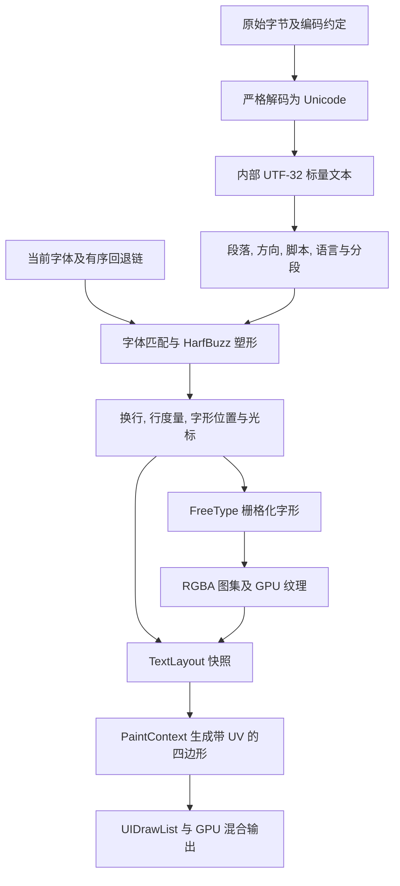

# 文字管线: 字节, Unicode, 字体, 编排与渲染

## 概念

| 概念 | 定义 | 不应混淆 |
|---|---|---|
| 字符集 | 字符及其编号的集合; Unicode 为字符分配码点 | 字体不是字符编码 |
| 码点 | Unicode 编号，例如 `中 = U+4E2D`, `😀 = U+1F600` | 码点不是字形编号 |
| Unicode 标量值 | 除代理码点 U+D800..U+DFFF 外的有效 Unicode 码点 | UTF-16 代理项不能单独作为字符 |
| 编码 | 将标量值映射到字节或码元，如 UTF-8/16/32 | 不是选择字体，也不是源码转义 |
| 码元 | 编码的基本单位: UTF-8 为 8 位，UTF-16 为 16 位，UTF-32 为 32 位 | `string.size()` 通常不是字符数; 有效 UTF-32 的码元数是标量数，不是字素簇数 |
| 字素簇 | 用户感知的字符单位，可能由多个码点组成 | 光标不能简单按字节移动 |
| 字形 | 字体中的视觉形状，由字体局部的 glyph ID 标识 | 一个码点不一定对应一个字形 |
| 塑形簇 | HarfBuzz 将字形关联回输入位置的分组 | 不保证等同完整 Unicode 字素分割 |
| 字体覆盖 | 字体能否为字符或序列提供所需字形 | 成功解码不代表能显示 |

例: `😀` 是一个码点; UTF-8 为 `F0 9F 98 80`，UTF-16 为 `D83D DE00` 两个码元，UTF-32 为 `0001F600`.UTF-16/32 保存成字节时还需约定大小端.`e` 加 U+0301 可以显示为一个带重音字母; `fi` 可被字体塑形成连字; ZWJ emoji 可由多个码点合成一个字形.

## 全流程与职责

上图是完整管线的职责分解，不表示当前实现已具备完整分段能力.本仓库只有显式段落换行, run 方向推断, 简化空白换行与缺字簇回退，尚没有完整双向段落算法和脚本 itemization.

## 输入, 编码与解码

应用通过 `getCurrentTextEncoding()` / `setCurrentTextEncoding()` 访问唯一的 `Options.Text.Encoding` 状态.设置影响后续创建的 TextWidget，已有控件保留自己的 TextConfig 副本，不自动重解释已有字节.Custom 要求配置解码器.

`encodeText(std::u32string_view, Config)` 显式把 UTF-32 源文本编码为指定 UTF8/16/32 字节，遵循 ByteOrder, 保留 NUL, 不添加 BOM; `App.encodeText(std::u32string_view)` 重载使用应用当前配置.Main 用一份 UTF-32 示例 `U"Hello, 你好 氼, A€中😀"` 构造匹配配置的输入，不再按编码写分支.真实输入若已按配置编码，直接传给 `createTextWidget()`，不要重复 encode.Custom 只有解码器，不支持此编码操作.

- `getTextBytes()` 仅暴露原始字节; C++ 的 `string`, `u16string`, `u32string` 类型不替调用方选择编码.
- `TextConfig.Encoding` 决定如何解释字节; UTF-16/32 使用 `ByteOrder`.编码错误可能导致乱码或异常，与字体无关.
- TextWidget 构造与 `setText()` 在原始字节边界按 TextConfig 调用 `decodeTextToUTF32()`，直接得到内部 UTF-32，不经过 UTF-8 输出包装.`TextService::createTextLayout()` 的文本参数只接受 `std::u32string_view`，`TextLayout::Text` 拥有 `std::u32string`.
- `CustomDecoder` 仍接收原始字节并返回 UTF-8; 其输出立即经严格验证转换为 UTF-32，不作为内部存储.缺少解码器会报错，解码器自身异常原样传播.
- 现有 `decodeText()` 返回 UTF-8，`encodeText(std::string_view UTF8, Config)` 及 `App.encodeText(std::string_view UTF8)` 接收 UTF-8，仅保留兼容用途: 分别包装 UTF-32 解码后转 UTF-8, UTF-8 转 UTF-32 后编码，不是内部管线入口.
- 当前非法输入抛异常: UTF-8 过长编码, 非法续字节, 截断, 非法标量; UTF-16 不配对代理项; UTF-32 非法标量.没有自动猜编码或替换成 U+FFFD.
- 当前不自动剥离 BOM，不做 NFC/NFD 规范化.若文件输入需要这些能力，应在输入层明确策略，避免悄悄改动编辑器原文.
- 源码 `\u4E2D` 是编译器转义; 运行时读到字符 `\`, `u`, `4` 等不会自动执行转义.解码和解析转义是不同操作.

独立 [Unicode.hpp](../include/Editor/Unicode.hpp)/[Unicode.cpp](../src/Unicode.cpp) 提供六个两两转换 API: `utf8ToUTF32()`, `utf16ToUTF32()`, `utf32ToUTF8()`, `utf32ToUTF16()`, `utf8ToUTF16()`, `utf16ToUTF8()`.转换参数为相应编码的码元视图; UTF-16/32 的这些转换不涉及字节序，返回值拥有存储.`decodeTextToUTF32()` 和 UTF-32 源的 `encodeText()` 则负责配置指定的原始字节及字节序.所有转换严格验证，保留 NUL, 已有 BOM 和标量顺序，不做规范化.`validateUTF32()` 拒绝代理标量及超过 U+10FFFF 的码元，允许 NUL 和非字符.

有效 UTF-32 的每个码元对应一个 Unicode 标量，因此码点随机访问为 O(1); 这不等于字素簇随机访问，也不自动提供正确的光标导航.每个标量占四字节，对 ASCII 和多数常用文本比 UTF-8 占用更多内存.UTF-8 仍适合文件, SDL 文本事件, 剪贴板和网络等外部边界，并非只用于网络; 进入内部布局前必须按真实编码转换.SDL 事件的 UTF-8 编码不随应用 TextConfig 改变.

代码入口: [TextConfig.cpp](../src/TextConfig.cpp), [TextWidget.cpp](../src/TextWidget.cpp).

## 字体集合, 当前字体与回退

本节的 headless 指测试编译目标: `EditorTestApplication` 私有定义 `EDITOR_TEST_NO_GPU=1`，关闭应用字体初始化和 Renderer 创建.正式程序没有运行时 GPU 开关; 该测试宏不影响正式 `EditorApplication`.

配置由 `GenericApplication` 持有的 `ApplicationOptions` 保存: 

| 字段 / 接口 | 含义 |
|---|---|
| `DefaultFontPaths` | 有序默认文字字体候选; 路径列表，不是打包字体或 OS 字体数据库 |
| `EmojiFontPaths` | 有序 emoji 字体候选，包含 Apple Color Emoji, Segoe UI Emoji, Noto Color Emoji |
| `FontPath` / `getCurrentFontPath()` | 当前主字体文件路径 |
| `Text.FallbackFontPaths` / `getFallbackFontPaths()` | 有序缺字回退路径链; 不是撤销历史中的"回滚" |

GPU 初始化规则: 主字体为空则取首个存在的默认候选; 无可用候选则初始化失败.回退链为空时，追加所有存在的默认文字候选，再追加 emoji 候选，排除主字体路径和重复字符串; 显式非空回退链按原顺序保留.文件存在仅是初筛，是否为支持的 Unicode 字体由 TextService 加载时验证.headless 模式只保存配置，不要求字体文件存在.

`--font` 仍指定主字体.通过 `ApplicationOptions` 可以自定义候选集合及回退链.当前空回退链表示使用默认链，没有单独的"禁用自动回退"开关.配置初始化后只读，没有运行时字体切换接口; 不写入磁盘.TextWidget 保存配置副本并拥有独立 TextService，加载字体, 保存句柄; 应用保存的是路径而不是服务局部句柄.既有快照不会因为外部配置修改而自动重排.

候选默认不再包含固定路径.`DiscoverSystemFonts` 默认开启: GPU 初始化时，对空候选集合使用 OS 查询自动填充; macOS 调用 CoreText，Windows 调用 DirectWrite，Linux 调用 Fontconfig.显式非空候选集合不被覆盖; 关闭发现可完全使用自定义字体，headless 初始化不触发查询.Linux 构建需要 Fontconfig 开发包.

发现模块对系统字体路径去重，用 FreeType 检查第零个 face 的 Unicode 覆盖: 可缩放且包含 A 的文字字体按中文/欧元覆盖与非粗斜体偏好排序，最多保留四个; 包含 U+1F600 且声明彩色能力的字体归入 emoji 集合，最多保留两个.排序相同时按路径顺序稳定选择.这是有限样本启发式，不是 OS 默认 UI 字体匹配或完整字符集覆盖保证.彩色能力也不保证所有彩色格式都能渲染.

当前用 `FT_New_Face(..., 0, ...)` 打开第零个 face; TTC 可以包含多个 face，目前未暴露 face index，可能遗漏其他 face 的覆盖.OS API 目前仅用于发现字体文件，未承担文本排版.实现见 [SystemFonts.cpp](../src/SystemFonts.cpp).

代码入口: [GenericApplication.hpp](../include/Editor/GenericApplication.hpp), [GenericApplication.cpp](../src/GenericApplication.cpp), [TextService.cpp](../src/TextService.cpp).

## 字体映射, 塑形与缺字回退

1. 设置字号及物理像素尺度.FreeType 为可缩放字体设置尺寸; 固定尺寸字体选择最接近的 strike，再记录缩放比例.
2. HarfBuzz 读取内部 UTF-32 输入，cluster 使用标量索引，不再使用 UTF-8 字节偏移.字体 `cmap` 提供初始字符映射，字体中的 GSUB/GPOS 等规则可能执行连字, 替换, 附标定位和字距调整.
3. 结果为 glyph ID, cluster, `x/y_advance` 与 `x/y_offset`.advance 移动排版笔，offset 只改变当前字形相对排版笔的位置.
4. 当前主字体结果的某个 cluster 含 glyph ID 0 时，将该簇的输入范围交给回退字体重新塑形; 取首个没有 glyph ID 0 的非空结果.字形编号只在各自字体中有效，因此结果同时记录字体句柄.
5. 全部回退失败则保留主字体缺字结果，可能显示 `.notdef` 方框，而非保证每个输入都可见.

回退应保留足够的上下文; 孤立塑形可能破坏阿拉伯文连接等上下文规则.当前按主字体簇替换是简化方案，并非完整跨字体复杂脚本排版.emoji 回退也不是检查字符是否位于某个 emoji 范围: 主字体没有字形时才尝试后续字体.

VS15/VS16 可以请求文本/emoji 呈现; 肤色修饰, 区域旗帜, ZWJ 序列依赖序列塑形和字体覆盖.主字体有单色字形就可能不触发缺字回退，所以"能显示"不等于"按预期显示彩色 emoji".

## 编排, 基线与尺寸

- 逻辑字号 `Size` 与 `PixelScale` 相乘得到物理尺寸.代码中的 `PixelSize` 实际保存 26.6 定点尺寸，即物理像素乘 64; 布局坐标再除以 PixelScale 回到逻辑单位.
- 当前行的 ascent/descent/height 取主字体和所有配置回退字体的最大度量，即使回退未使用也可能增大行高.这避免裁剪，但不是精确的逐行已使用字体度量.
- 同行共用基线; 字形顶部由 baseline, 塑形 offset 和 FreeType `bitmap_top` 决定.相同基线不保证可见图像顶部, 底部或中心一致.
- 拉丁 x-height, 中文方形字面, emoji 透明留白和字体 bearing 不同; 相同字号不是相同可见高度.固定尺寸缩放还有像素取整.对齐诊断应先显示基线及字形边界，再考虑光学校正，不能直接按底边对齐所有字形.
- 当前按 CR/LF 分段，软换行只在部分空白字符后的安全簇边界尝试; 不支持完整 Unicode 行断规则, 中文标点禁则, 自动断词或整段混合 BiDi.
- `TextLayout` 保存已生成的字形, 光标和 Metrics.`measure()` 返回现有尺寸; `arrange()` 记录分配区域，不按新宽度自动重新塑形或换行.
- `TextGlyph::Cluster`, `TextCaret::Offset`, `hitTest()` 返回值及 `getCaretRect()` 的偏移参数均为内部 UTF-32 标量索引（码点索引），不是 UTF-8 字节偏移, 原始输入字节偏移或 UTF-16 码元索引.当前光标位置只按塑形簇边界构建，不额外生成逐码点或连字内部 caret，不等于完整编辑器的字素导航, 选择区域或双向文本光标策略.

## 字形图像, 图集与 GPU

FreeType 用 `FT_LOAD_COLOR` 加载字形: 普通轮廓经栅格化得到灰度覆盖率，位图字体可能直接提供位图.当前接受 GRAY, MONO, BGRA; 不宣称覆盖全部 COLR v1/SVG 等彩色格式.PNG 位图需要构建时 libpng 支持.

- 普通字形存白色 RGB + 覆盖率 alpha，着色时乘文字 Tint.
- BGRA 彩色位图为预乘颜色; 上传前交换通道并反预乘，转为渲染器要求的直通 RGBA8.绘制时 RGB tint 为白色，只继承文字 alpha.
- 固定 strike 位图当前以最近邻采样缩放，不是高质量滤波; 缩小质量可独立改进，不应改变编码或字体选择.
- 图集页固定 1024×1024，采用 shelf 分配，字形周围保留一像素透明边界.缓存键是字体句柄, glyph ID, 请求物理尺寸; 同一 glyph ID 在不同字体间不能共享.
- `TextLayout` 中每个字形保存 Texture, Bounds, UV, Cluster, Colored.PaintContext 将其转成四边形和批次，不再解码或塑形.
- GPU 使用 HLSL 着色器采样图集并结合顶点颜色/透明度混合.Widget 与 GPU 后端通过 UIDrawList 解耦.
- 图集创建/上传/销毁只能在帧外; TextService 必须先于它引用的 Renderer 销毁.快照的纹理句柄只有在所属服务和图集仍存活时有效.

代码入口: [TextLayout.hpp](../include/Editor/TextLayout.hpp), [PaintContext.cpp](../src/PaintContext.cpp), [UIRenderer.cpp](../src/UIRenderer.cpp).

## OS 排版服务的替代位置

CoreText, DirectWrite，以及 Linux 的字体匹配/布局栈，可以提供系统字体发现, 匹配, 回退和更成熟的文本布局.它们不必接管应用的 GPU 绘制: 可将平台排版结果转换为统一的 TextLayout，再生成字形纹理.FreeType/HarfBuzz 路径便于统一实现和使用内置字体，但完整段落算法, 字体发现和回退上下文需要额外维护.不同后端的字形位置, 字体选择与像素输出不应假定完全相同.

## 故障定位与验证

| 症状 | 优先检查 |
|---|---|
| 乱码或解码异常 | 输入字节, Encoding, ByteOrder, 截断, 代理项; 不是先换字体 |
| 方框或缺字符 | cmap/序列覆盖, 实际字体 face, glyph ID 0, 回退顺序 |
| emoji 单色或被染黑 | 呈现选择, 实际选中字体, 彩色格式支持, Colored 标志及 tint |
| emoji 高低不齐 | 共用基线, bitmap bearing, offset, strike 缩放, 透明留白 |
| 清晰度差 | PixelScale, 物理字号, 位图重采样, GPU 纹理采样 |
| 换行或光标错误 | 字素/塑形簇边界, BiDi, advance, 换行规则与重新布局时机 |
| 偶发 GPU 错误 | 帧外上传规则, 纹理句柄寿命, 服务与 renderer 析构顺序 |

验证不能只看"未崩溃": 应检查真实字形非缺字, 图集 alpha 非空, emoji 非灰色 RGB, 基线/边界, 缓存复用, UTF8/16/32 等价输入, 不同 DPI 和布局宽度.当前 UITextChinese / UITextEmoji 使用真实字体检查字形及彩色图集; GPU 三帧 smoke 证明路径可运行，不等于最终窗口像素已比对.