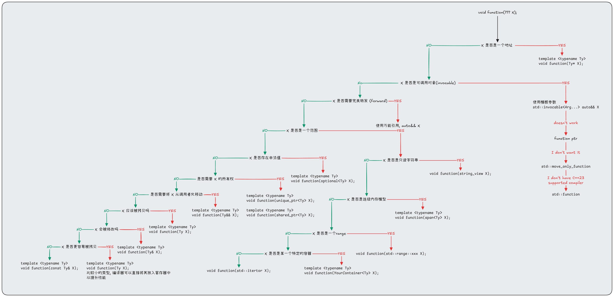

## 在函数边界处优化性能
[The Most Important Optimizations to Apply in Your C++ Programs - Jan Bielak - CppCon 2022](https://www.youtube.com/watch?v=qCjEN5XRzHc)
在 Jan Bielak 的演示中第 23. 选择合适的参数类型, 可以提供一个基础的思考模型, 以优化性能.


其中有以下两点符合这次的主题:
1. <font color="#c0504d">对于非平凡的只读对象, 应以常量引用的形式传递, 以避免不必要的复制</font>

`void Print(elephant s) { /* ... */ }` 此时会发生一次拷贝, 应该使用 `void Print(const elephant& s) { /* ... */ }` 来避免这一次拷贝
通过在 clang-tidy 开启检查 `--checks=performance-unnecessary-value-param` 来检查
对于只读 `std::string` 的情况, 应该使用 `std::string_view ` 来优化这个过程.

2. <font color="#c0504d">传递小型对象时, 建议按值传递, 因为按引用传递可能会妨碍优化</font>
[CppCoreGuidelines-F16](https://isocpp.github.io/CppCoreGuidelines/CppCoreGuidelines#rf-in)
```Cpp
struct Point { int x = 0; int y = 0; };
void PrintInt(const int& i) { std::cout << i << '\n'; }
void PrintPoint(const Point& pt) {
    std::cout << pt.x << ", " << pt.y << '\n'; 
}
// 改为
void PrintInt(int i) { std::cout << i << '\n'; }
void PrintPoint(Point pt) {
    std::cout << pt.x << ", " << pt.y << '\n'; 
}
```
编译器会在编译时使用寄存器来对小对象进行优化, 如果使用引用则会失去这些优化, 原因是<u>编译器必须假定该引用可能指向任何内存地址</u>，从而引发别名问题, 进而阻碍以下优化
1. 寄存器分配: 有的架构 ABI 规定小尺寸的 Trivial 类型可通过寄存器直接传值, 若按引用传递, 传入的永远是指针, 函数体内部可能会执行 `Load` 指令从内存读取数据(现代编译器都很聪明, 这里还是可以使用寄存器)
2. 别名分析: 编译器无法确定 `const Type&` 指向的内存与函数内访问的其他内存是否重叠, 从而无法优化

这里的小对象是指: Trivial Objects
- 拥有平凡的默认构造, 拷贝构造, 移动构造, 析构函数
- 内存布局连续, 无虚函数, 无虚继承

## NRVO 优化和 Copy Elision
当一个函数返回一个对象时，按照通常的规则，会发生两次构造和析构操作：
1. 在函数内部构造局部对象，准备返回。
2. 将返回的对象拷贝到函数调用点的上下文中，然后销毁局部对象。

通过返回值优化，编译器可以直接在调用点构造返回对象，避免额外的拷贝构造。RVO 通常有两种类型：

- 命名返回值优化(Named Return Value Optimization, NRVO)：当函数内的局部变量有一个明确的名称，并且用于返回的情况。
- 未命名返回值优化(RVO)：当函数返回一个临时对象(如 `return A();`)，这种优化可以直接在返回位置构造对象。
```Cpp
A Foo() { 
    A a{10, 10}; 
    return std::move(a); 
}
```
在上述例子中, `std::move` 会影响 NRVO 优化, 导致临时对象被创建.
此时使用 `-Wprssimizing-move` 来开启对应的警告信息.
在C++17标准之后, 应该依赖 Copy Elision 而不是 NRVO. 因为 Copy Elision 是编译器强制保证的. (又叫做URVO)
```Cpp
A NRVO() { 
    A a{10, 10};
    // 触发 NRVO
    return a; 
}
A CopyElision() { 
    // 返回匿名对象, 触发 Copy Elision
    return {10, 10}; 
}
```
同时, 如果依赖 NRVO 标准要求对象必须可以拷贝和移动(即使优化后不调用, 但编译器仍需检查语义合法性). 如果只提供移动构造而没有拷贝构造, 则在 `return obj;` 时触发编译错误. 此时你必须写 `return std::move(obj);` 但是这又会影响 NRVO

## Copy elide: 优化 std::optional 的构造
[CppCon2024 Hidden Overhead of a Function API](https://www.bilibili.com/video/BV14YyfYhE3C?spm_id_from=333.788.videopod.episodes&vd_source=75cdf78dd1707c1077825f0501243c43&p=17)
[Arthur O'Dwyer Superconstrcting super elider, round 2](https://quuxplusone.github.io/blog/2018/05/17/super-elider-round-2/)
[Andrzej's C++ blog: Revalues redefined](https://akrzemi1.wordpress.com/2018/05/16/rvalues-redefined/)
[知乎: Copy elide](https://zhuanlan.zhihu.com/p/652518852)
```Cpp
#include <optional>
struct large {
    large();
    large(large&&);
    large(const large&);
    large& operator=(large&&);
    large& operator=(const large&);
};
large make_large();

std::optional<large> optional_large() {
    return std::optional<large>{ make_large() };
}
```
以上代码生成了复杂的汇编指令, 见 [Test](https://godbolt.org/z/bcdsx7aP4)
原因是编译器使用了 `constexpr optional(U&& value);` 这个构造函数, 而由于 `large` 和 `std::optional<large>` 并不是相同的类型, 所以此时无法使用拷贝消除语义, 所以编译器只能使用 `large` 的右值来构造内部的持久化对象.

所以, 不需要使用值去构造 `optional`, 而是告诉 `optional` 一个可转换对象, 让 `optional` 在自己的存储中直接构造.
```Cpp
template <typename Function>
struct lazy {
    operator std::invoke_result_t<Function>() {
        return function();
    }
    Function function;
};
template <typename Function>
lazy(Function&&) -> lazy<Function>;

std::optional<large> lazy_optional_large() {
    return std::optional<large>{ lazy{make_large} };
}
```
上述的 `lazy` 是一个延迟转换器. 即对于 `large` 的例子中. `Function = large(*)()` 则 `operator std::invoke_result_t<Function>()` 等价于 `operator large()`. 此时的 `lazy{make_large}` 并不是一个 `large` 的右值, 所以 `optional` 构造内部 `large` 时,不是"接收一个现成的 `large` 再 move 进去", 而是"拿一个 `lazy` 来初始化 `large`".
相当于: `new (storage) large(lazy_obj);` -> `lazy_obj.operator large();` -> `return function();` -> `return make_large();`
`lazy` 的功能并不是构造 `large` 而是如何构造 `lazy`, 从而在 `optional` 正式构造的时候再调用对应的 `make_large()`
在上述优化之后, 生成了更加简单指令 [Test](https://godbolt.org/z/PYq6KTPKh)
